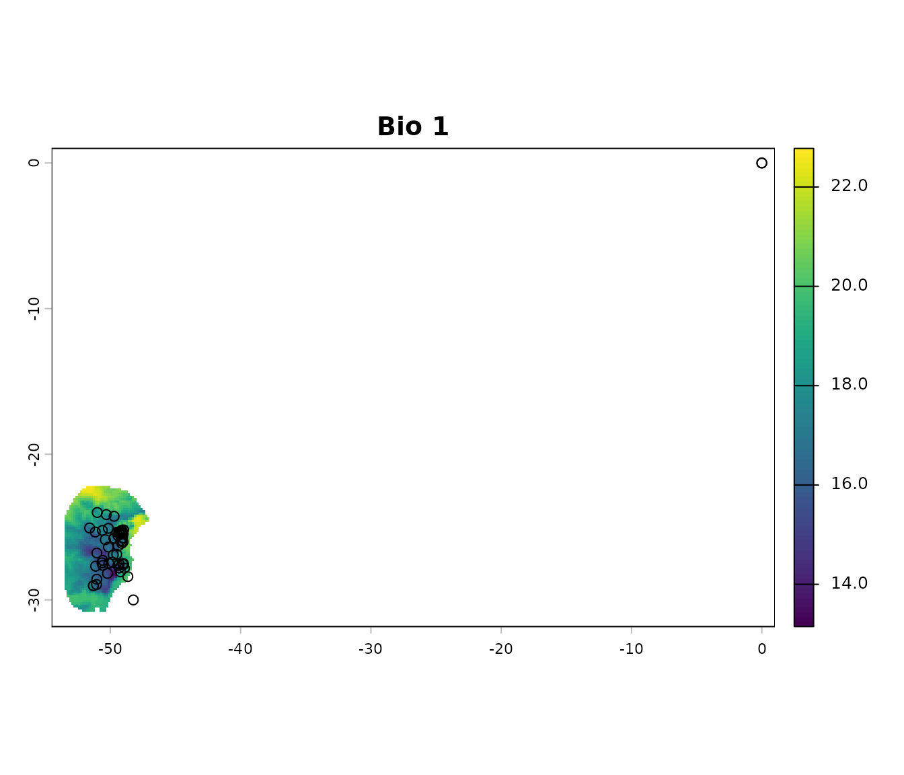

# 1. Basic Data Cleaning

## Summary

- [Description](#description)
- [Getting ready](#getting-ready)
- [Cleaning data](#cleaning-data)
  - [Import data](#import-data)
  - [Basic cleaning steps](#basic-cleaning-steps)
  - [Other cleaning steps](#other-cleaning-steps)  
- [Saving results](#saving-results)

------------------------------------------------------------------------

## Description

As any modeling technique, ecological niche modeling depends on the
quality of the input data, particularly species occurrence records.
Cleaning these data is a critical step to minimize biases, reduce
errors, and ensure meaningful model outcomes. This vignette introduces
tools available in the `kuenm2` package to facilitate the *cleaning of
occurrence data* prior to modeling. It guides users through inspecting
data, applying cleaning functions, and saving cleaned datasets, all
within a reproducible R workflow.

We want to highlight that additional data cleaning and filtering steps
(e.g., spatial thinning) may be necessary depending on the type of model
or modeling approach the user intends to adopt. The tools presented here
are designed to assist with the most basic steps of cleaning data for
modeling.

  

## Getting ready

If `kuenm` has not been installed yet, please do so. See the [Main
guide](https://marlonecobos.github.io/kuenm2/index.md) for installation
instructions.

Load `kuenm` and any other required packages, and define a working
directory (if needed). In general, setting a working directory in R is
considered good practice, as it provides better control over where files
are read from or saved to. If users are not working within an R project,
we recommend setting a working directory, since at least one file will
be saved at later stages of this guide.

Note: functions from other packages (i.e., not from base R or `kuenm`)
used in this guide will be displayed as `package::function()`.

``` r
# Load packages
library(kuenm2)
library(terra)

# Current directory
getwd()

# Define new directory
#setwd("YOUR/DIRECTORY")  # uncomment and modify if setting a new directory

# Saving original plotting parameters
original_par <- par(no.readonly = TRUE)
```

  

## Cleaning data

### Import data

We will use occurrence records provided within the `kuenm` package. Most
example data sets in the package were derived from [Trindade & Marques
(2024)](https://doi.org/10.1111/ddi.13931). The `occ_data_noclean`
object contains 51 valid occurrences of *Myrcia hatschbachii* (a tree
endemic to Southern Brazil) and a group of erroneous records to
demonstrate cleaning steps.

``` r
# Import occurrences
data(occ_data_noclean, package = "kuenm2")

# Check data structure
str(occ_data_noclean)
#> 'data.frame':    64 obs. of  3 variables:
#>  $ species: chr  "Myrcia hatschbachii" "Myrcia hatschbachii" "Myrcia hatschbachii" "Myrcia hatschbachii" ...
#>  $ x      : num  -51.3 -50.6 -49.3 -49.8 -50.2 ...
#>  $ y      : num  -29 -27.6 -27.8 -26.9 -28.2 ...
```

  

A raster layer included in the package will also be used in this
example. This is a bioclimatic variable from [WorldClim
2.1](https://worldclim.org/data/bioclim.html) at 10 arc-minute
resolution. This layer has been masked using a polygon generated by
drawing a minimum convex polygon around the records with a 300 km
buffer.

``` r
# Import raster layers
var <- terra::rast(system.file("extdata", "Current_variables.tif", 
                               package = "kuenm2"))

# Keep only one layer
var <- var$bio_1

# Check variable
terra::plot(var)
```


  

Visualize occurrences records in geography:

``` r
# Visualize occurrences on one variable
## Create an extent based on the layer and the records to see all errors
vext <- terra::ext(var)  # extent of layer
pext <- apply(occ_data_noclean[, 2:3], 2, range, na.rm = TRUE)  # extent of records

allext <- terra::ext(c(min(pext[1, 1], vext[1]), max(pext[2, 1], vext[2]), 
                       min(pext[1, 2], vext[3]), max(pext[2, 2], vext[4]))) + 1

# plotting records on the variable
terra::plot(var, ext = allext, main = "Bio 1")
points(occ_data_noclean[, c("x", "y")])
```



  

### Basic cleaning steps

The basic data cleaning steps implemented in `kuenm` help to: remove
missing data, eliminate duplicates, exclude typically (though not
always) erroneous coordinates with 0 longitude and 0 latitude, and
filter out records with low coordinate precision based on the number of
decimal places.

Below is an example of cleaning missing data. This example uses a
`data.frame` containing only the columns “Species”, “x”, and “y” (where
“x” and “y” represent longitude and latitude, respectively). If the
`data.frame` includes additional columns and not all of them should be
considered when identifying missing values, users can specify which
columns to use via the `columns` argument (default = `NULL`, which
includes all columns). As with any function, we recommend consulting the
documentation for more detailed explanations (e.g.,
[`help(remove_missing)`](https://marlonecobos.github.io/kuenm2/reference/initial_cleaning.md)).

``` r
# remove missing data
mis <- remove_missing(data = occ_data_noclean, columns = NULL, remove_na = TRUE,
                      remove_empty = TRUE)

# quick check
nrow(occ_data_noclean)
#> [1] 64
nrow(mis)
#> [1] 60
```

  

The code below uses the previous results and continues the process of
cleaning data by removing duplicates. The argument `columns` can be used
as explained before. See full documentation with
[`help(remove_duplicates)`](https://marlonecobos.github.io/kuenm2/reference/initial_cleaning.md).

``` r
# remove exact duplicates
mis_dup <- remove_duplicates(data = mis, columns = NULL, keep_all_columns = TRUE)

# quick check
nrow(mis)
#> [1] 60
nrow(mis_dup)
#> [1] 57
```

  

Continue the process by removing coordinates with values of 0 (zero) for
longitude and latitude (not always needed, as this location is valid if
working with some marine species). See full documentation with
[`help(remove_corrdinates_00)`](https://marlonecobos.github.io/kuenm2/reference/initial_cleaning.md).

``` r
# remove records with 0 for x and y coordinates
mis_dup_00 <- remove_corrdinates_00(data = mis_dup, x = "x", y = "y")

# quick check
nrow(mis_dup)
#> [1] 57
nrow(mis_dup_00)
#> [1] 56
```

  

The following lines of code take the previous result and remove
coordinates with low precision. If the longitude and latitude contain no
or only a few decimal places, they may have been rounded, which can be
problematic in some areas. This a step recommended when users know
coordinate rounding is an issue. This filtering process can also be
applied to longitude and latitude independently. See full documentation
with
[`help(filter_decimal_precision)`](https://marlonecobos.github.io/kuenm2/reference/initial_cleaning.md).

``` r
# remove coordinates with low decimal precision.
mis_dup_00_dec <- filter_decimal_precision(data = mis_dup_00, x = "x", y = "y", 
                                           decimal_precision = 2)

# quick check
nrow(mis_dup_00)
#> [1] 56
nrow(mis_dup_00_dec)
#> [1] 51
```

  

Users can perform all this steps with a single function
([`initial_cleaning()`](https://marlonecobos.github.io/kuenm2/reference/initial_cleaning.md))
as follows:

``` r
# all basic cleaning steps
clean_init <- initial_cleaning(data = occ_data_noclean, species = "species", 
                               x = "x", y = "y", remove_na = TRUE, 
                               remove_empty = TRUE, remove_duplicates = TRUE, 
                               by_decimal_precision = TRUE,
                               decimal_precision = 2)

# quick check
nrow(occ_data_noclean)  # original data
#> [1] 64
nrow(clean_init)  # data after all basic cleaning steps
#> [1] 51

# a final plot to check
par(mfrow = c(2, 2))

## initial data
terra::plot(var, ext = allext, main = "Initial data")
points(occ_data_noclean[, c("x", "y")])

## data after basic cleaning steps
terra::plot(var, ext = allext, main = "After basic cleaning")
points(clean_init[, c("x", "y")])

terra::plot(var, main = "After basic cleaning (zoom)")
points(clean_init[, c("x", "y")])
```


  

### Other cleaning steps

Two additional cleaning steps are implemented in `kuenm`, removing cell
duplicates and moving points to valid cells.

Removing cell duplicates involves excluding records that are not exact
coordinate duplicates but are located within the same pixel. The process
randomly selects one record from each cell to retain. See full
documentation with
[`help(remove_cell_duplicates)`](https://marlonecobos.github.io/kuenm2/reference/advanced_cleaning.md).

``` r
# exclude duplicates based on raster cell (pixel)
celldup <- remove_cell_duplicates(data = clean_init, x = "x", y = "y",
                                  raster_layer = var)

# quick check
nrow(clean_init)  # data after all basic cleaning steps
#> [1] 51
nrow(celldup)  # plus removing cell duplicates
#> [1] 42
```

  

The following lines of code help adjust records that fall just outside
valid raster cells to prevent data loss. Given the nature and resolution
of raster layers, valid records are sometimes perceived as being outside
the boundaries of cells with data. In such cases, an alternative is to
move these records to the nearest valid cell. A distance limit is
applied to avoid relocating records that are too far from the study
area. See below for an example of how to use this functionality of
`kuenm`. See full documentation with
[`help(move_2closest_cell)`](https://marlonecobos.github.io/kuenm2/reference/advanced_cleaning.md).

``` r
# move records to valid pixels
moved <- move_2closest_cell(data = celldup, x = "x", y = "y", 
                            raster_layer = var, move_limit_distance = 10)
#> Moving occurrences to closest pixels...

# quick check
nrow(celldup)  # basic cleaning and no cell duplicates
#> [1] 42
nrow(moved[moved$condition != "Not_moved", ])  # plus moved to valid cells
#> [1] 41
```

  

The function
[`advanced_cleaning()`](https://marlonecobos.github.io/kuenm2/reference/advanced_cleaning.md)
facilitates the two processes from above in a single step:

``` r
# move records to valid pixels
clean_data <- advanced_cleaning(data = clean_init, x = "x", y = "y", 
                                raster_layer = var, cell_duplicates = TRUE,
                                move_points_inside = TRUE, 
                                move_limit_distance = 10)
#> Moving occurrences to closest pixels...

# exclude points not moved
clean_data <- clean_data[clean_data$condition != "Not_moved", 1:3]

# quick check
nrow(occ_data_noclean)  # original data
#> [1] 64
nrow(clean_init)  # data after all basic cleaning steps
#> [1] 51
nrow(clean_data)  # data after all basic cleaning steps
#> [1] 41

# a final plot to check
par(mfrow = c(3, 2))

## initial data
terra::plot(var, ext = allext, main = "Initial")
points(occ_data_noclean[, c("x", "y")])

## data after basic cleaning steps
terra::plot(var, ext = allext, main = "Basic cleaning")
points(clean_init[, c("x", "y")])

terra::plot(var, main = "Basic cleaning (zoom)")
points(clean_init[, c("x", "y")])

## data after basic cleaning steps
terra::plot(var, main = "Final data")
points(clean_data[, c("x", "y")])

## zoom to a particular area, initial data
terra::plot(var, xlim = c(-48, -50), ylim = c(-26, -25),  main = "Initial (zoom +)")
points(occ_data_noclean[, c("x", "y")])

## zoom to a particular area, final data
terra::plot(var, xlim = c(-48, -50), ylim = c(-26, -25),  main = "Final (zoom +)")
points(clean_data[, c("x", "y")])
```


  

Notes:

- The functions that move records to valid pixels do not erase points
  that were not moved. Make sure to exclude them as indicated in the
  previous chunk of code, if that is what is needed.

``` r
# Reset plotting parameters
par(original_par) 
```

  

## Saving results

The results of the data cleaning steps in `kuenm` are simple
`data.frames` that may include a few additional columns and fewer
records than the original dataset. An easy way to save these results is
by writing them to CSV files. Although multiple options exist for saving
this type of data, another useful alternative is to save it as an RDS
file in your directory. See the examples below:

``` r
# Save as CSV
write.csv(clean_data, file = "Clean_data.csv", row.names = FALSE)

# Save as RDS
saveRDS(clean_data, file = "Clean_data.rds")
```
