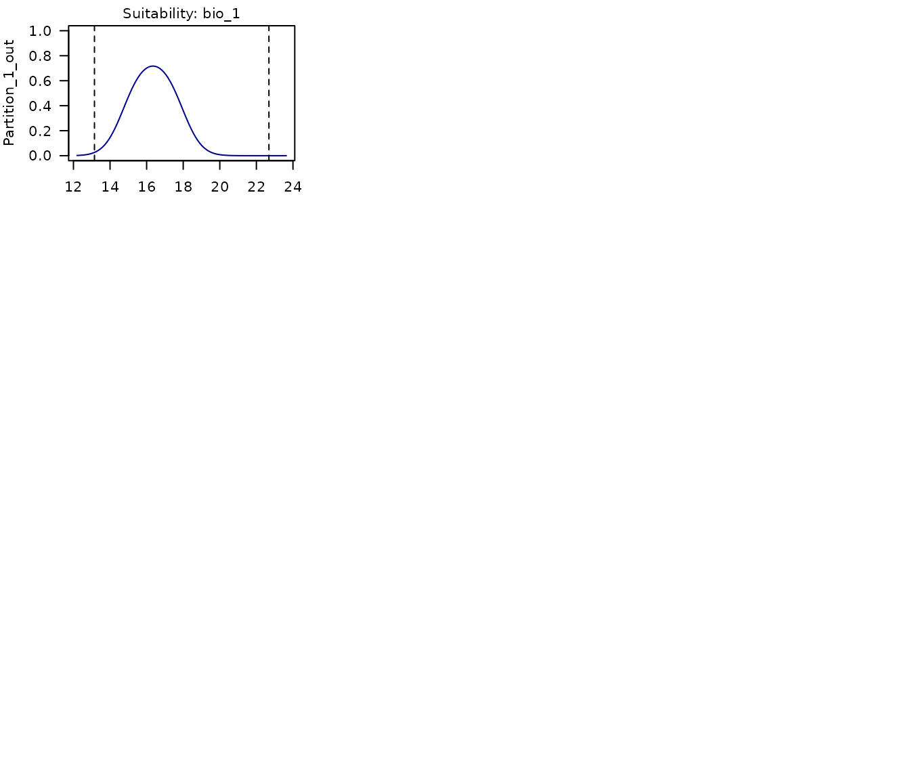
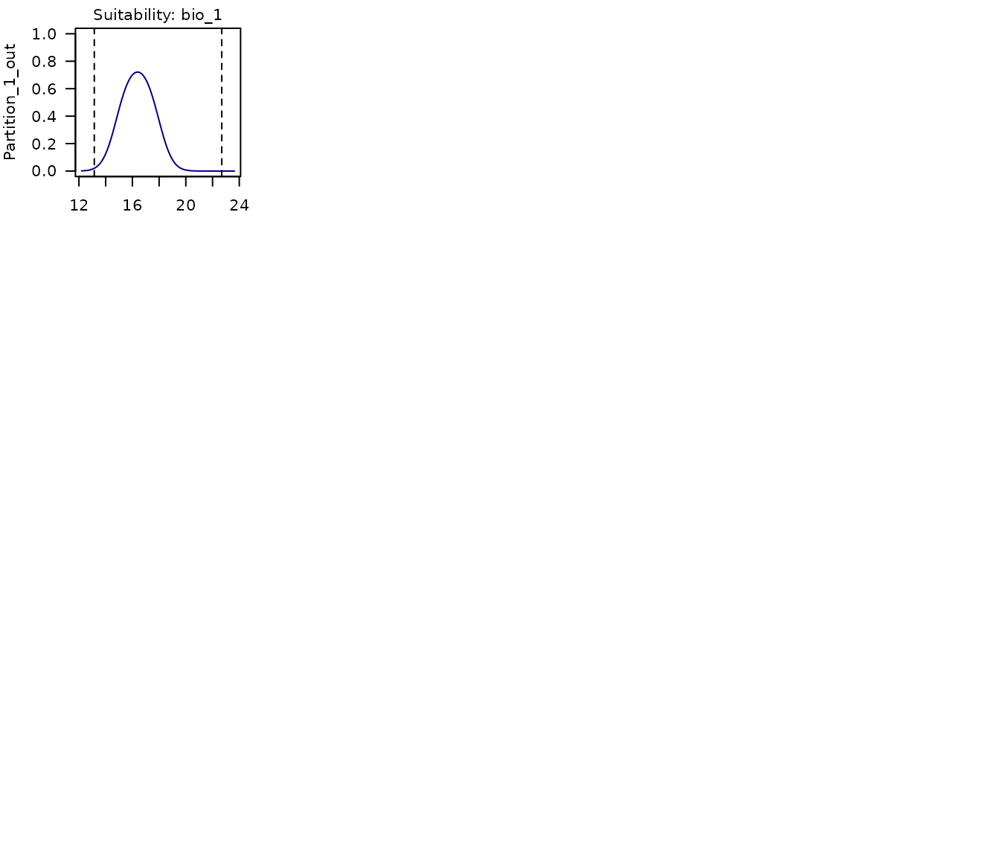

# 3. Model Calibration

## Summary

- [Description](#description)
- [Getting ready](#getting-ready)
- [Preparing data](#prepare-data)
- [Calibration](#calibration)
  - [Maxnet Models](#maxnet-models)
  - [GLM Models](#glm-models)
  - [Concave curves](#concave-curves)
- [Re-selecting models](#re-selecting-models)
- [Training partion effects](#training-partion-effects)
- [Saving a calibration_results
  object](#saving-a-calibration_results-object)

------------------------------------------------------------------------

## Description

Model calibration is one of the most computationally intensive processes
automated in `kuenm2`. In this step, candidate models are trained and
tested using a cross-validation approach as defined in the object
`prepared_data`. Then, models are selected based on multiple criteria to
warranty that the models used in later steps are the most robust among
the candidates. This vignette guides users in running model calibration
examples to explore and understand the options included and the results
from the process.

  

## Getting ready

At this point it is assumed that `kuenm2` is installed (if not, see the
[Main guide](https://marlonecobos.github.io/kuenm2/index.md)). Load
`kuenm2` and any other required packages, and define a working directory
(if needed).

Note: functions from other packages (i.e., not from base R or `kuenm2`)
used in this guide will be displayed as `package::function()`.

``` r
# Load packages
library(kuenm2)
library(terra)

# Current directory
getwd()

# Define new directory
#setwd("YOUR/DIRECTORY")  # uncomment and modify if setting a new directory

# Saving original plotting parameters
original_par <- par(no.readonly = TRUE)
```

  

## Preparing data

To start the calibration process, we need a `prepared_data` object. For
more details in data preparation, please refer to the vignette [prepare
data for model
calibration](https://marlonecobos.github.io/kuenm2/articles/prepare_data.md).

To start, let’s create two `prepared_data` objects: one using the maxnet
as the algorithm, and another with GLMs:

``` r
# Import occurrences
data(occ_data, package = "kuenm2")

# Import raster layers
var <- rast(system.file("extdata", "Current_variables.tif", package = "kuenm2"))

# Prepare data for maxnet model
d_maxnet <- prepare_data(algorithm = "maxnet",
                         occ = occ_data,
                         x = "x", y = "y",
                         raster_variables = var,
                         species = "Myrcia hatschbachii",
                         categorical_variables = "SoilType", 
                         partition_method = "kfolds", 
                         n_partitions = 4,
                         n_background = 1000,
                         features = c("l", "q", "lq", "lqp"),
                         r_multiplier = c(0.1, 1, 2))

# Prepare data for glm model
d_glm <- prepare_data(algorithm = "glm",
                      occ = occ_data,
                      x = "x", y = "y",
                      raster_variables = var,
                      species = "Myrcia hatschbachii",
                      categorical_variables = "SoilType", 
                      partition_method = "bootstrap", 
                      n_partitions = 10, 
                      train_proportion = 0.7,
                      n_background = 300,
                      features = c("l", "q", "p", "lq", "lqp"),
                      r_multiplier = NULL)  # Not necessary with glms
```

  

## Calibration

The
[`calibration()`](https://marlonecobos.github.io/kuenm2/reference/calibration.md)
function fits and evaluates candidate models considering the follow
metrics:

- Unimodality (optional) of responses: Assessing the coefficients of
  quadratic terms, following [Arias-Giraldo & Cobos
  (2024)](https://journals.ku.edu/jbi/article/view/21742).
- Omission error: calculated using models trained with separate testing
  data subsets. Users can specify multiple omission rates to be
  considered (e.g., c(5%, 10%)), though only one can be used as the
  threshold for selecting the best models.
- Model complexity (AIC): assessed using models generated with the
  complete set of occurrences.
- Partial ROC: calculated following [Peterson et
  al. (2008)](http://dx.doi.org/10.1016/j.ecolmodel.2007.11.008), for
  models that meet previous criteria (by default).

  

In summary, to calibrate and evaluate the models, the function requires
a `prepared_data` object and the following definitions:

- **Omission Errors:** Values ranging from 0 to 100, representing the
  percentage of potential error attributed to various sources of
  uncertainty in the data. These values are utilized in the calculation
  of omission rates and partial ROC.
- **Omission Rate for Model Selection:** The specific omission error
  threshold used to select models. This value defines the maximum
  omission rate a candidate model can have to be considered for
  selection.
- **Removal of Concave Curves:** A specification of whether to exclude
  candidate models that exhibit concave curves.

Optional arguments allow for modifications such as changing the delta
AIC threshold for model selection (default is 2), determining whether to
add presence samples to the background (default is `TRUE`), and whether
to employ user-specified weights. For a comprehensive description of all
arguments, refer to
[`?calibration`](https://marlonecobos.github.io/kuenm2/reference/calibration.md).

In this example, we will evaluate the models considering two omission
errors (5% and 10%), with model selection based on a 10% omission error.
To accelerate the process, the argument `parallel` can be set to `TRUE`
and specify the number of cores to utilize. To detect the number of
available cores on your machine, run
[`parallel::detectCores()`](https://rdrr.io/r/parallel/detectCores.html).

  

### Maxnet Models

Let’s calibrate the maxnet models:

``` r
#Calibrate maxnet models
m_maxnet <- calibration(data = d_maxnet, 
                        error_considered = c(5, 10),
                        omission_rate = 10,
                        parallel = FALSE,  # Set TRUE to run in parallel
                        ncores = 1)  # Define number of cores to run in parallel
# Task 1/1: fitting and evaluating models:
#   |=====================================================================| 100%
# 
# Model selection step:
# Selecting best among 300 models.
# Calculating pROC...
# 
# Filtering 300 models.
# Removing 0 model(s) because they failed to fit.
# 135 models were selected with omission rate below 10%.
# Selecting 2 final model(s) with delta AIC <2.
# Validating pROC of selected models...
#   |=====================================================================| 100%
# All selected models have significant pROC values.
```

  

The
[`calibration()`](https://marlonecobos.github.io/kuenm2/reference/calibration.md)
function returns a `calibration_results` object, a list containing
various essential pieces of information from the calibration process.
The elements of this object can be explored by printing the object or
indexing them. All evaluation metrics are stored within the
`calibration_results` element, see how to explore them below:

``` r
# See first rows of the summary of calibration results
head(m_maxnet$calibration_results$Summary[, c("ID", "Omission_rate_at_10.mean", 
                                              "AICc", "Is_concave")])
#>   ID Omission_rate_at_10.mean     AICc Is_concave
#> 1  1                   0.0978 665.8779      FALSE
#> 2  2                   0.0978 665.9493      FALSE
#> 3  3                   0.0978 665.8956      FALSE
#> 4  4                   0.1378 678.2084      FALSE
#> 5  5                   0.1378 678.1407      FALSE
#> 6  6                   0.1170 678.1182      FALSE
```

  

We can also examine the details of the selected models:

``` r
# See first rows of the summary of calibration results
m_maxnet$selected_models[, c("ID", "Formulas", "R_multiplier",
                             "Omission_rate_at_10.mean", "AICc", "Is_concave")]
#>      ID
#> 192 192
#> 219 219
#>                                                                                      Formulas
#> 192                        ~bio_1 + bio_7 + bio_15 + I(bio_1^2) + I(bio_7^2) + I(bio_15^2) -1
#> 219 ~bio_1 + bio_7 + bio_12 + bio_15 + I(bio_1^2) + I(bio_7^2) + I(bio_12^2) + I(bio_15^2) -1
#>     R_multiplier Omission_rate_at_10.mean     AICc Is_concave
#> 192          0.1                   0.0769 608.8669      FALSE
#> 219          0.1                   0.0962 610.0462      FALSE
```

  

When printed, the `calibration_results` object provides a summary of the
model selection process. This includes the total number of candidate
models considered, the number of models that failed to fit, and the
number of models exhibiting concave curves (along with an indication of
whether these were removed). Additionally, it reports the number of
models excluded due to non-significant partial ROC (pROC) values, high
omission error rates, or elevated AIC values. Finally, a summary of the
metrics for up to five selected models is presented.

``` r
print(m_maxnet)
#> calibration_results object summary (maxnet)
#> =============================================================
#> Species: Myrcia hatschbachii 
#> Number of candidate models: 300 
#>   - Models removed because they failed to fit: 0 
#>   - Models identified with concave curves: 39 
#>   - Model with concave curves not removed 
#>   - Models removed with non-significant values of pROC: 0 
#>   - Models removed with omission error > 10%: 165 
#>   - Models removed with delta AIC > 2: 133 
#> Selected models: 2 
#>   - Up to 5 printed here:
#>      ID
#> 192 192
#> 219 219
#>                                                                                      Formulas
#> 192                        ~bio_1 + bio_7 + bio_15 + I(bio_1^2) + I(bio_7^2) + I(bio_15^2) -1
#> 219 ~bio_1 + bio_7 + bio_12 + bio_15 + I(bio_1^2) + I(bio_7^2) + I(bio_12^2) + I(bio_15^2) -1
#>     Features R_multiplier pval_pROC_at_10.mean Omission_rate_at_10.mean
#> 192       lq          0.1                    0                   0.0769
#> 219       lq          0.1                    0                   0.0962
#>         dAIC Parameters
#> 192 0.000000          6
#> 219 1.179293          7
```

  

In this example, of the 300 candidate **maxnet** models fitted, two were
selected based on a significant pROC value, a low omission error
(\<10%), and a low AIC score (\<2).

  

### GLM Models

Now, let’s calibrate the GLM Models to see if different models factors
are selected with this algorithm:

``` r
#Calibrate maxnet models
m_glm <- calibration(data = d_glm, 
                     error_considered = c(5, 10),
                     omission_rate = 10,
                     parallel = FALSE,  # Set TRUE to run in parallel
                     ncores = 1)  # Define number of cores to run in parallel
# Task 1/1: fitting and evaluating models:
#   |=====================================================================| 100%
# Model selection step:
# Selecting best among 122 models.
# Calculating pROC...
# 
# Filtering 122 models.
# Removing 0 model(s) because they failed to fit.
# 21 models were selected with omission rate below 10%.
# Selecting 1 final model(s) with delta AIC <2.
# Validating pROC of selected models...
#   |=====================================================================| 100%
# All selected models have significant pROC values.
```

  

Now, instead of two selected models, we have only one:

``` r
m_glm
#> calibration_results object summary (glm)
#> =============================================================
#> Species: Myrcia hatschbachii 
#> Number of candidate models: 122 
#>   - Models removed because they failed to fit: 0 
#>   - Models identified with concave curves: 18 
#>   - Model with concave curves not removed 
#>   - Models removed with non-significant values of pROC: 0 
#>   - Models removed with omission error > 10%: 101 
#>   - Models removed with delta AIC > 2: 20 
#> Selected models: 1 
#>   - Up to 5 printed here:
#>    ID                                                        Formulas Features
#> 85 85 ~bio_1 + bio_7 + bio_12 + I(bio_1^2) + I(bio_7^2) + I(bio_12^2)       lq
#>    pval_pROC_at_10.mean Omission_rate_at_10.mean dAIC Parameters
#> 85                    0                   0.0904    0          6
```

  

### Concave curves

It is worth noting that with both maxnet and glm algorithm, some models
were identified as having concave response curves. Concave (or bimodal)
curves indicate that higher suitability is found at variable values
around a point of lower suitability. For example, as shown in the right
panel of the figure below, higher suitability is observed in both the
driest and wettest regions, with lower suitabilities occurring at
intermediate precipitation levels.


Figure 1. Representation of convex (left) and concave (right) response
curves. Dashed lines indicate limist of envrionmental conditions for
model training.

  

In our example, none of the maxnet selected models have concave
responses, but the GLM selected had at least one concave response:

``` r
#Selected maxnet models
m_maxnet$selected_models[, c("ID", "Formulas", "Is_concave")]
#>      ID
#> 192 192
#> 219 219
#>                                                                                      Formulas
#> 192                        ~bio_1 + bio_7 + bio_15 + I(bio_1^2) + I(bio_7^2) + I(bio_15^2) -1
#> 219 ~bio_1 + bio_7 + bio_12 + bio_15 + I(bio_1^2) + I(bio_7^2) + I(bio_12^2) + I(bio_15^2) -1
#>     Is_concave
#> 192      FALSE
#> 219      FALSE

#Selected glm models
m_glm$selected_models[, c("ID", "Formulas", "Is_concave")]
#>    ID                                                        Formulas
#> 85 85 ~bio_1 + bio_7 + bio_12 + I(bio_1^2) + I(bio_7^2) + I(bio_12^2)
#>    Is_concave
#> 85       TRUE
```

  

This shows that a model with concave responses could be selected if it
has low omission rate and AIC values. To **ensure that none of the
selected models have concave curves**, you can set
`remove_concave = TRUE` within the
[`calibration()`](https://marlonecobos.github.io/kuenm2/reference/calibration.md)
function. Let’s test it with the maxnet algorithm:

``` r
m_unimodal <- calibration(data = d_maxnet, 
                          remove_concave = TRUE,  # Ensures concave models are not selected
                          error_considered = c(5, 10),
                          omission_rate = 10)
# Task 1/2: checking for concave responses in models:
#   |=====================================================================| 100%
# 
# Task 2/2: fitting and evaluating models with no concave responses:
#   |=====================================================================| 100%
# 
# Model selection step:
# Selecting best among 300 models.
# Calculating pROC...
# 
# Filtering 300 models.
# Removing 0 model(s) because they failed to fit.
# Removing 39 model(s) with concave curves.
# 110 models were selected with omission rate below 10%.
# Selecting 2 final model(s) with delta AIC <2.
# Validating pROC of selected models...
#   |=====================================================================| 100%
# All selected models have significant pROC values.
```

  

Note that the process is now divided into two tasks:

- Task 1: Only candidate models that include quadratic terms are fitted.
  For GLMs, all models with quadratic terms are tested. For maxnet
  models, the version of the models with quadratic terms with the
  highest regularization multiplier is tested. This is because if a
  maxnet model produces a concave response at a high regularization
  value, it will do the same at lower values.

- Task 2: In this step, the function fits and evaluates two groups of
  models: (1) models without quadratic terms; and (2) models with
  quadratic terms, but only those with formulas that did not produce
  concave responses in Task 1.

  

## Re-selecting models

The model selection procedure is conducted internally during the
calibration process. However, it is possible to re-select models by
considering other omission rates (since these were calculated during
calibration), model complexity (delta AIC), and removing or not models
with concave responses.

To optimize computational time,
[`calibration()`](https://marlonecobos.github.io/kuenm2/reference/calibration.md)
calculates pROC values only for models pre-selected based on omission
and complexity considerations (default). Consequently, pROC values for
models that were not pre-selected are filled with `NA`.

``` r
# See first rows of the summary of calibration results (pROC values)
head(m_maxnet$calibration_results$Summary[, c("ID", "Mean_AUC_ratio_at_10.mean",
                                              "pval_pROC_at_10.mean")])
#>   ID Mean_AUC_ratio_at_10.mean pval_pROC_at_10.mean
#> 1  1                        NA                   NA
#> 2  2                        NA                   NA
#> 3  3                        NA                   NA
#> 4  4                        NA                   NA
#> 5  5                        NA                   NA
#> 6  6                        NA                   NA
# See pROC values of selected models
m_maxnet$selected_models[, c("ID", "Mean_AUC_ratio_at_10.mean", 
                             "pval_pROC_at_10.mean")]
#>      ID Mean_AUC_ratio_at_10.mean pval_pROC_at_10.mean
#> 192 192                  1.497376                    0
#> 219 219                  1.502309                    0
```

  

When pROC is not calculated for all models during
[`calibration()`](https://marlonecobos.github.io/kuenm2/reference/calibration.md),
the
[`select_models()`](https://marlonecobos.github.io/kuenm2/reference/select_models.md)
function requires the `prepared_data` used during the calibration step,
and `compute_proc` must be set to `TRUE`. For instance, let’s re-select
maxnet models applying an omission rate of 5% instead 10%:

``` r
# Re-select maxnet models
new_m_maxnet <- select_models(calibration_results = m_maxnet, 
                              data = d_maxnet,  # Needed to compute pROC
                              compute_proc = TRUE, 
                              omission_rate = 5)  # New omission rate
#> Selecting best among 300 models.
#> Calculating pROC...
#> 
#> Filtering 300 models.
#> Removing 0 model(s) because they failed to fit.
#> 116 model(s) were selected with omission rate below 5%.
#> Selecting 2 final model(s) with delta AIC <2.
#> Validating pROC of selected models...
#> 
#> All selected models have significant pROC values.

print(new_m_maxnet)
#> calibration_results object summary (maxnet)
#> =============================================================
#> Species: Myrcia hatschbachii 
#> Number of candidate models: 300 
#>   - Models removed because they failed to fit: 0 
#>   - Models identified with concave curves: 39 
#>   - Model with concave curves not removed 
#>   - Models removed with non-significant values of pROC: 0 
#>   - Models removed with omission error > 5%: 184 
#>   - Models removed with delta AIC > 2: 114 
#> Selected models: 2 
#>   - Up to 5 printed here:
#>      ID                                                           Formulas
#> 159 159                        ~bio_1 + bio_7 + I(bio_1^2) + I(bio_7^2) -1
#> 189 189 ~bio_1 + bio_7 + bio_12 + I(bio_1^2) + I(bio_7^2) + I(bio_12^2) -1
#>     Features R_multiplier pval_pROC_at_5.mean Omission_rate_at_5.mean      dAIC
#> 159       lq          0.1                   0                  0.0192 0.8581936
#> 189       lq          0.1                   0                  0.0192 0.0000000
#>     Parameters
#> 159          4
#> 189          6
```

  

If a `calibration_results` object is provided,
[`select_models()`](https://marlonecobos.github.io/kuenm2/reference/select_models.md)
will return a `calibration_results` output with the selected models and
summary updated. Note that we now have different selected models with
the maxnet algorithm:

``` r
new_m_maxnet$selected_models[,c("ID", "Formulas", "R_multiplier", 
                                "Omission_rate_at_5.mean", 
                                "Mean_AUC_ratio_at_5.mean",
                                "AICc", "Is_concave")]
#>      ID                                                           Formulas
#> 159 159                        ~bio_1 + bio_7 + I(bio_1^2) + I(bio_7^2) -1
#> 189 189 ~bio_1 + bio_7 + bio_12 + I(bio_1^2) + I(bio_7^2) + I(bio_12^2) -1
#>     R_multiplier Omission_rate_at_5.mean Mean_AUC_ratio_at_5.mean     AICc
#> 159          0.1                  0.0192                 1.476587 622.7677
#> 189          0.1                  0.0192                 1.512957 621.9095
#>     Is_concave
#> 159      FALSE
#> 189      FALSE
```

  

You can also provide a `data.frame` containing the evaluation metrics
for each candidate model directly to
[`select_models()`](https://marlonecobos.github.io/kuenm2/reference/select_models.md).
This `data.frame` is available in the output of the
[`calibration()`](https://marlonecobos.github.io/kuenm2/reference/calibration.md)
function under `object$calibration_results$Summary`. In this case, the
function will return a list containing the selected models along with
summaries of the model selection process.

``` r
#Re-select models using data.frame
new_summary <- select_models(candidate_models = m_maxnet$calibration_results$Summary,
                             data = d_maxnet,  # Needed to compute pROC
                             compute_proc = TRUE, 
                             omission_rate = 5)
#> Selecting best among 300 models.
#> Calculating pROC...
#> 
#> Filtering 300 models.
#> Removing 0 model(s) because they failed to fit.
#> 116 model(s) were selected with omission rate below 5%.
#> Selecting 2 final model(s) with delta AIC <2.
#> Validating pROC of selected models...
#> 
#> All selected models have significant pROC values.

#Get class of object
class(new_summary)
#> [1] "list"

#See selected models
new_summary$selected_models[, c("ID", "Formulas", "R_multiplier", 
                                "Omission_rate_at_5.mean", 
                                "Mean_AUC_ratio_at_5.mean",
                                "AICc", "Is_concave")]
#>      ID                                                           Formulas
#> 159 159                        ~bio_1 + bio_7 + I(bio_1^2) + I(bio_7^2) -1
#> 189 189 ~bio_1 + bio_7 + bio_12 + I(bio_1^2) + I(bio_7^2) + I(bio_12^2) -1
#>     R_multiplier Omission_rate_at_5.mean Mean_AUC_ratio_at_5.mean     AICc
#> 159          0.1                  0.0192                 1.478714 622.7677
#> 189          0.1                  0.0192                 1.508287 621.9095
#>     Is_concave
#> 159      FALSE
#> 189      FALSE
```

  

## Training partion effects

After model calibration, selected models can be explored to understand
the effect of leaving testing data out in every cross-validation
process. This can help understand if leaving a testing partition out
changes dramatically response curves compared to using other sets of
data. These explorations can also be used to understand if the ability
of models to predict testing records derives from extrapolation or not,
and whether extrapolations are safe.

The function
[`partition_response_curves()`](https://marlonecobos.github.io/kuenm2/reference/partition_response_curves.md)
can be used to perform the explorations mentioned above for each of the
selected models in the `calibration_results` object.

``` r
# ID of models that were selected
m_maxnet$selected_models$ID
#> [1] 192 219

# Response curves for model 192
partition_response_curves(calibration_results = m_maxnet, modelID = 192)
```



  

In the multi-panel plot produced above, we can see the response curves
for each of the variables used in the model. Each panel shows:

- The response curve for the variable in a model fit with a portion of
  the data that leaves out the partition labeled in the y axis.
- Points of records used for testing, the ones corresponding to the
  partition left out.
- Dashed lines representing the limits of the environmental values in
  the data used to fit models.

The same can be done for each of the models selected. Below is a plot
for the second model selected in this example.

``` r
# Response curves for model 219
partition_response_curves(calibration_results = m_maxnet, modelID = 219)
```



  

``` r
# Reset plotting parameters
par(original_par) 
```

  

## Saving a calibration_results object

After calibrating and selecting the best-performing models, we can
proceed to fit the final models (see the vignette for model exploration)
using the `calibration_results` object. As this object is essentially a
list, users can save it to a local directory using
[`saveRDS()`](https://rspatial.github.io/terra/reference/serialize.html).
Saving the object facilitates loading it back into your R session later
using
[`readRDS()`](https://rspatial.github.io/terra/reference/serialize.html).
See an example below:

``` r
# Set directory to save (here, in a temporary directory)
dir_to_save <- file.path(tempdir())

# Save the data
saveRDS(m_maxnet, file.path(dir_to_save, "Candidates_maxnet.rds"))

# Import data
m_maxnet <- readRDS(file.path(dir_to_save, "Candidates_maxnet.rds"))
```
