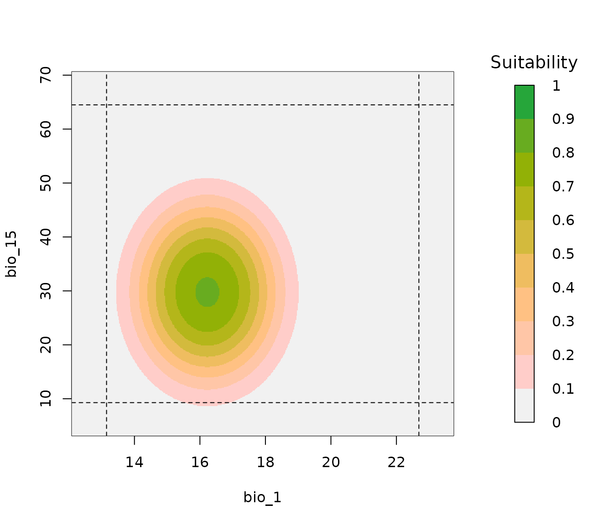
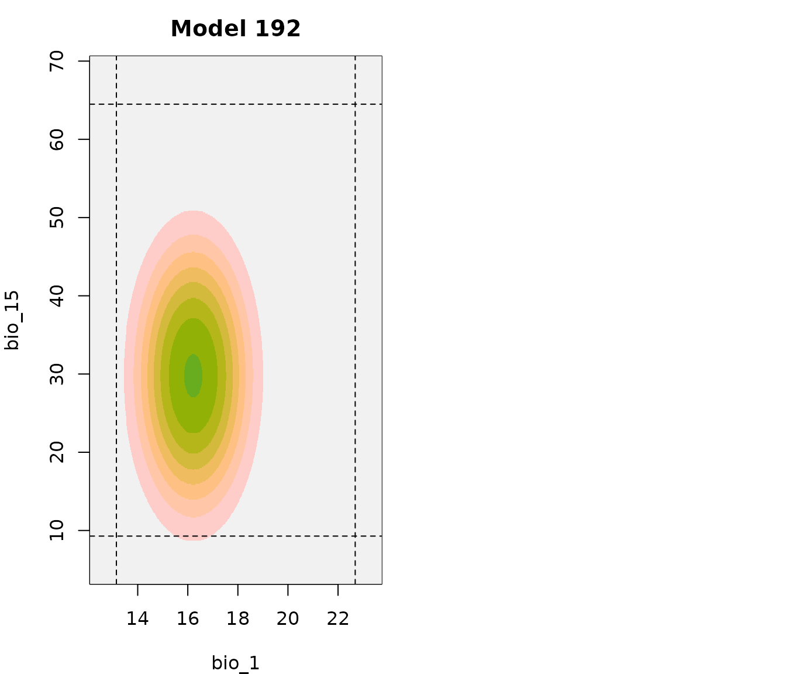

# 4. Fit and Explore Selected Models

## Summary

- [Description](#description)
- [Getting ready](#getting-ready)
- [Fitting selected models](#fitting-selected-models)
- [Response curves](#response-curves)
  - [All response curves](#all-response-curves)
  - [Customized response curves](#customized-response-curves)
  - [Bivariate response curves](#bivariate-response-curves)
- [Variable importance](#variable-importance)
- [Model evaluation with independent
  data](#model-evaluation-with-independent-data)
- [Saving a fitted_models object](#saving-a-fitted_models-object)

------------------------------------------------------------------------

## Description

After the best performing models have been selected, users need to fit
this models (using
[`fit_selected()`](https://marlonecobos.github.io/kuenm2/reference/fit_selected.md))
in order to explore their characteristics and continue with the next
steps. Fitted models can then be used to assess variable importance in
models, as well as to explore variable response curves. Selected models
can also be evaluated using independent records that were not used
during calibration. This vignettes contains examples to explore the
multiple options available to fit and explore selected models.

  

## Getting ready

At this point it is assumed that `kuenm2` is installed (if not, see the
[Main guide](https://marlonecobos.github.io/kuenm2/index.md)). Load
`kuenm2` and any other required packages, and define a working directory
(if needed).

Note: functions from other packages (i.e., not from base R or `kuenm2`)
used in this guide will be displayed as `package::function()`.

``` r
# Load packages
library(kuenm2)
library(terra)

# Current directory
getwd()

# Define new directory
#setwd("YOUR/DIRECTORY")  # uncomment and modify if setting a new directory

# Saving original plotting parameters
original_par <- par(no.readonly = TRUE)
```

  

## Fitting selected models

To fit the selected models, we need a `calibration_results` object. For
more details in model calibration, please refer to the vignette [Model
Calibration](https://marlonecobos.github.io/kuenm2/articles/model_calibration.md).
The `calibration_results` object generated in this vignette is available
as a data example in the package. Let’s load it.

``` r
# Import an example of calibration results 
data("calib_results_maxnet", package = "kuenm2")

# Print calibration result
calib_results_maxnet
#> calibration_results object summary (maxnet)
#> =============================================================
#> Species: Myrcia hatschbachii 
#> Number of candidate models: 300 
#>   - Models removed because they failed to fit: 0 
#>   - Models identified with concave curves: 39 
#>   - Model with concave curves not removed 
#>   - Models removed with non-significant values of pROC: 0 
#>   - Models removed with omission error > 10%: 165 
#>   - Models removed with delta AIC > 2: 133 
#> Selected models: 2 
#>   - Up to 5 printed here:
#>      ID
#> 192 192
#> 219 219
#>                                                                                      Formulas
#> 192                        ~bio_1 + bio_7 + bio_15 + I(bio_1^2) + I(bio_7^2) + I(bio_15^2) -1
#> 219 ~bio_1 + bio_7 + bio_12 + bio_15 + I(bio_1^2) + I(bio_7^2) + I(bio_12^2) + I(bio_15^2) -1
#>     Features R_multiplier pval_pROC_at_10.mean Omission_rate_at_10.mean
#> 192       lq          0.1                    0                   0.0769
#> 219       lq          0.1                    0                   0.0962
#>         dAIC Parameters
#> 192 0.000000          6
#> 219 1.179293          7
```

  

This object contains the results of candidate models calibrated using
the `maxnet` algorithm. The package also provides a similar example wit
models created using the `glm` algorithm. See below how to load the
`calib_results_glm` object in case you want to explore it.

``` r
# Import calib_results_glm
data("calib_results_glm", package = "kuenm2")

# Print calibration result
calib_results_glm
#> calibration_results object summary (glm)
#> =============================================================
#> Species: Myrcia hatschbachii 
#> Number of candidate models: 122 
#>   - Models removed because they failed to fit: 0 
#>   - Models identified with concave curves: 18 
#>   - Model with concave curves not removed 
#>   - Models removed with non-significant values of pROC: 0 
#>   - Models removed with omission error > 10%: 101 
#>   - Models removed with delta AIC > 2: 20 
#> Selected models: 1 
#>   - Up to 5 printed here:
#>    ID                                                        Formulas Features
#> 85 85 ~bio_1 + bio_7 + bio_12 + I(bio_1^2) + I(bio_7^2) + I(bio_12^2)       lq
#>    pval_pROC_at_10.mean Omission_rate_at_10.mean dAIC Parameters
#> 85                    0                   0.0904    0          6
```

  

Note that the `calibration_results` object stores only the information
related to the calibration process and model evaluation, it does not
include the fitted `maxnet` (or `glm`) models.

To obtain fitted models, we need to use the
[`fit_selected()`](https://marlonecobos.github.io/kuenm2/reference/fit_selected.md)
function. By default, this function fits a full model (i.e., without
replicates and without splitting the data into training and testing
sets). However, you can configure it to fit final models with replicates
if desired.

In this example, we’ll fit the final models with 4 k-fold replicates
(leaving one fold out), as in the [Model
Calibration](https://marlonecobos.github.io/kuenm2/articles/model_calibration.md)
vignette.

``` r
# Fit selected models using calibration results
fm <- fit_selected(calibration_results = calib_results_maxnet, 
                   replicate_method = "kfolds", n_replicates = 4)
# Fitting replicates...
#   |========================================================================| 100%
# Fitting full models...
#   |========================================================================| 100%
```

  

The
[`fit_selected()`](https://marlonecobos.github.io/kuenm2/reference/fit_selected.md)
function returns a `fitted_models` object, a list that contains
essential information from the fitted models, which is required for the
subsequent steps.

You can explore the contents of the `fitted_models` object by indexing
its elements. For example, the fitted `maxnet` (or `glm`) model objects
are stored within the `Models` element. Note that `Models` is a nested
list: for each selected model (in this case, models 192 and 219), it
includes both the replicates (if fitted with replicates) and the full
model.

``` r
# See names of selected models
names(fm$Models)
#> [1] "Model_192" "Model_219"

# See models inside Model 192
names(fm$Models$Model_192)
#> [1] "Replicate_1" "Replicate_2" "Replicate_3" "Replicate_4" "Full_model"
```

  

The `fitted_models` object also stores the thresholds that can be used
to binarize the models into suitable and unsuitable areas. These
thresholds correspond to the omission error used during model selection
(e.g., 5% or 10%).

You can access the omission error used to calculate the thresholds
directly from the object:

``` r
# Get omission error used to select models and calculate the theshold values
fm$omission_rate
#> [1] 10
```

  

The omission error used to calculate the thresholds was 10%, meaning
that when the predictions are binarized, approximately 10% of the
presence records used to calibrate the models will fall into cells with
predicted values below the threshold.

The thresholds are summarized in two ways: the mean and median across
replicates for each model, and the consensus mean and median across all
selected models (when more than one model is selected):

``` r
fm$thresholds
#> $Model_192
#> $Model_192$mean
#> [1] 0.2449115
#> 
#> $Model_192$median
#> [1] 0.266498
#> 
#> 
#> $Model_219
#> $Model_219$mean
#> [1] 0.260294
#> 
#> $Model_219$median
#> [1] 0.2695625
#> 
#> 
#> $consensus
#> $consensus$mean
#> [1] 0.2526028
#> 
#> $consensus$median
#> [1] 0.2680302
#> 
#> 
#> $type
#> [1] "cloglog"
```

  

## Response curves

The selected models in the `fitted_models` object can be used to
generate response curves. Individual variable response curves illustrate
how each environmental variables influences suitability, while keeping
all other variables constant.

By default, the curves are generated with all other variables set to
their mean values (or the mode for categorical variables). The mean or
mode are calculated from the combined set of presence and background
data (`averages_from = "pr_bg"`). You can change this behavior to use
only the presence localities by setting `averages_from = "pr"`.

  

### All response curves

An easy way to explore response curves for all variables is as follows:

``` r
# Produce response curves for all variables in all fitted models
all_response_curves(fm)
```


  

In the previous plot, the dashed lines indicate the range of variables
values in the data used to fit models. If multiple models were fitted,
variability is shown via a Generalized Additive Model (GAM) using the
mean and the 95% confidence interval. For a more detailed view of what
the response curve for each of the models fitted look like, the argument
`show_lines` can be set to `TRUE`.

``` r
# All response curves showing each model as a different line
all_response_curves(fm, show_lines = TRUE)
```


  

To explore response curves of all variables for each model
independently, the argument `model_ID` can be used. The plot will show
variable response curves for the full model.

``` r
# All response curves for model 219
all_response_curves(fm, modelID = "Model_219")
```


  

To get a view of variability in response curves for a model produced
with replicates, use `show_variability = TRUE`. Both, the GAM or the
multiple-line approaches can be used to show variability.

``` r
# All response curves for model 219 (GAM for variability)
all_response_curves(fm, modelID = "Model_219", show_variability = TRUE)
```


``` r

# All response curves for model 219 (each curve is a replicate)
all_response_curves(fm, modelID = "Model_219", show_variability = TRUE, 
                    show_lines = TRUE)
```


  

### Customized response curves

The previous plots help to gain a quick understanding of response curves
for fitted models, but little can be done make each panel look better.
To produce nicer plots, response curves for each variable at a time can
be produced. Let’s check which variables are available to plot by
examining the coefficients of the full models:

``` r
# Get variables with non-zero coefficients in the models
fm$Models[[1]]$Full_model$betas  # From the first model selected
#>        bio_1        bio_7       bio_15   I(bio_1^2)   I(bio_7^2)  I(bio_15^2) 
#> 11.572321659  0.215970079  0.369077970 -0.356605446 -0.020306099 -0.006200151
fm$Models[[2]]$Full_model$betas  # From the second model selected
#>         bio_1        bio_12        bio_15    I(bio_1^2)    I(bio_7^2) 
#>  1.178814e+01  1.638570e-02  3.406100e-01 -3.625405e-01 -1.440450e-02 
#>   I(bio_12^2)   I(bio_15^2) 
#> -5.261860e-06 -5.623987e-03
```

  

The variables `bio_1`, `bio_7`, `bio_12` and `bio_15`have non-zero
coefficient values, which means they contribute to the model and are
available for generating response curves.

Remember that response curves are computed using all selected models.
This time let’s change the margins and labels for each plot

``` r
par(mfrow = c(2, 2), mar = c(4, 4, 1, 0.5))  # Set grid of plot
response_curve(models = fm, variable = "bio_1", las = 1)
response_curve(models = fm, variable = "bio_7", ylab = "", las = 1)
response_curve(models = fm, variable = "bio_12", las = 1)
response_curve(models = fm, variable = "bio_15", ylab = "", las = 1)
```


  

We can also specify which of the selected models should be used to
generate the response curves:

``` r
par(mfrow = c(2, 2), mar = c(4, 4, 2.5, 0.5))  # Set grid of plot
response_curve(models = fm, variable = "bio_1", modelID = "Model_192", 
               main = "Model_192", las = 1)
response_curve(models = fm, variable = "bio_1", modelID = "Model_219", 
               main = "Model_219", ylab = "", las = 1)
response_curve(models = fm, variable = "bio_7", modelID = "Model_192", 
               main = "Model_192", las = 1)
response_curve(models = fm, variable = "bio_7", modelID = "Model_219", 
               main = "Model_219", ylab = "", las = 1)
```


  

By default, the response curve extends beyond the range of model fitting
limits (dashed lines) based on the observed range of values and an
`extrapolation_factor` (when `extrapolation = TRUE`). The default
extrapolation factor is set to 10% of the range.

If `extrapolation = FALSE`, no extrapolation occurs, and the plot limits
match the fitting data range exactly.

We can increase the extrapolation factor to allow a broader range beyond
the observed data. Below is the response curve plotted with an
extrapolation factor of 2:

``` r
par(mfrow = c(2, 2), mar = c(4, 4, 1, 0.5))  # Set grid of plot
response_curve(models = fm, variable = "bio_1", extrapolation_factor = 2, 
               las = 1)
response_curve(models = fm, variable = "bio_7", extrapolation_factor = 2,
               ylab = "", las = 1)
response_curve(models = fm, variable = "bio_12", extrapolation_factor = 2,
               las = 1)
response_curve(models = fm, variable = "bio_15", extrapolation_factor = 2,
               ylab = "", las = 1)
```


  

Note that the response curve now extends further beyond the observed
data range. Optionally, we can manually set the lower and upper limits
of the variables. For example, since `bio_12` represents annual
precipitation and negative values are not realistic, we can set its
lower limit to 0:

``` r
response_curve(models = fm, variable = "bio_12", extrapolation_factor = 0.1, 
               l_limit = 0)
```


  

Now, the lower limit of the plot for `bio_12` is set to 0. Since we did
not specify an upper limit, the plot uses the extrapolation factor
(here, 0.1) to define the upper limit.

The other aspect to notice after increasing the extrapolation factor is
that the curves looked like they were not perfectly unimodal.
Unfortunately, using a GAM to summarize and represent variability can
some times generate this effect. However, plotting responses for each
model as independent curves will show the real shape of the curve, see
the differences after setting `show_lines = TRUE`.

``` r
par(mfrow = c(1, 2), mar = c(4, 4, 1, 0.5))  # Set grid of plot
response_curve(models = fm, variable = "bio_1", extrapolation_factor = 0.5, 
               las = 1)
response_curve(models = fm, variable = "bio_1", extrapolation_factor = 0.5, 
               show_lines = TRUE, ylab = "", las = 1)
```


  

Optionally, we can add the presence and background points used to fit
the models to the response curve plot by setting `add_points = TRUE`:

``` r
response_curve(models = fm, variable = "bio_1", show_lines = TRUE,
               add_points = TRUE)
```


  

### Bivariate response curves

All previous curve plots are showing responses to individual variables.
Exploring responses to two variables at a time can help understand the
small differences between models fitted with distinct terms. Let’s see
an example below:

``` r
# First, let's check the terms in the models fitted
## Model 192
fm$Models$Model_192$Full_model$betas
#>        bio_1        bio_7       bio_15   I(bio_1^2)   I(bio_7^2)  I(bio_15^2) 
#> 11.572321659  0.215970079  0.369077970 -0.356605446 -0.020306099 -0.006200151

## Model 219
fm$Models$Model_219$Full_model$betas
#>         bio_1        bio_12        bio_15    I(bio_1^2)    I(bio_7^2) 
#>  1.178814e+01  1.638570e-02  3.406100e-01 -3.625405e-01 -1.440450e-02 
#>   I(bio_12^2)   I(bio_15^2) 
#> -5.261860e-06 -5.623987e-03

# Example of a bivariate response plot 
bivariate_response(models = fm, variable1 = "bio_1", variable2 = "bio_15", 
                   modelID = "Model_192")
```



  

In the previous plot, the dashed lines represent the limits of the data
used for model fitting, and darker colors represent higher suitability.
Let’s now compare the two models and check if there are any differences.
Multiple bivariate response plots can be put together in a single plot
if the suitability bar legend is not used.

``` r
par(mfrow = c(1, 2), mar = c(4, 4, 2.5, 0.5))

# Bivariate response model 192 
bivariate_response(models = fm, variable1 = "bio_1", variable2 = "bio_15", 
                   modelID = "Model_192", add_bar = FALSE, main = "Model 192")

# Bivariate response model 219 
bivariate_response(models = fm, variable1 = "bio_1", variable2 = "bio_15", 
                   modelID = "Model_219", add_bar = FALSE, main = "Model 219", 
                   ylab = "")
```



  

These two models look very similar, the only noticeable difference is
that suitability values above the threshold extend farther on variable
bio_15 for model 219. More noticeable effects can be seen in bivariate
representations when fitted models include or not product terms.
However, as in this example, even a small variation on the number or
type of terms included in a model can change how predictions look like.

  

## Variable importance

The relative importance of model predictors can be calculated exploring
the deviance using the `var_importance()` function. This process starts
by fitting the full model (`maxnet` or `glm`), which includes all
predictors. Then, the function fits separate models excluding one
predictor at a time, and quantifies how the removal affects model
performance. The values of contribution are computed for variables by
default, but explorations by terms are also possible using the argument
`by_terms` (i.e., if the model includes linear and quadratic terms of a
variable, the process will run for each of them separately).

By default, the function runs on a single core. You can enable parallel
processing by setting `parallel = TRUE` and specifying the number of
cores with `ncores`. Note that parallelization only speeds up the
computation when there are many variables (e.g., \>17) and the
calibration dataset is large (e.g., over 15,000 total points).

Variable importance is computed for all selected models by default:

``` r
# Calculate variable importance
imp <- variable_importance(models = fm)

# Calculating variable contribution for model 1 of 2
#   |======================================================================| 100%
# Calculating variable contribution for model 2 of 2
#   |======================================================================| 100%
```

  

The function returns a `data.frame` with the relative contribution of
each variable. If multiple models are included in the `fitted` object,
an additional column identifies each model.

``` r
imp
#>   predictor contribution    Models
#> 1     bio_1  0.567815429 Model_192
#> 2    bio_15  0.219231619 Model_192
#> 3     bio_7  0.212952953 Model_192
#> 4     bio_1  0.721574882 Model_219
#> 5    bio_15  0.248819713 Model_219
#> 6    bio_12  0.025950948 Model_219
#> 7     bio_7  0.003654457 Model_219
```

  

We can visualize variable importance using the
[`plot_importance()`](https://marlonecobos.github.io/kuenm2/reference/plot_importance.md)
function. When the `fitted_models` object contains more than one
selected model, contributions are displayed as a boxplot, along with the
mean contribution, and the number (N) of fitted models with that
predictor.

``` r
plot_importance(imp)
```


  

If variable importance is computed for a single model, the plot displays
a bars instead of boxes:

``` r
# Calculate variable importance for a specific selected Model
imp_192 <- variable_importance(models = fm, modelID = "Model_192", 
                               progress_bar = FALSE)

# Plot variable contribution for model 192
plot_importance(imp_192, main = "Variable importance: Model 192")
```


  

The previous examples show how important are variables by checking the
change in models if we remove a variable completely from the equation.
To compute contribution of all variable terms (i.e., how important is to
keep distinct terms of the same variable) set `by_terms = TRUE`:

``` r
# Calculate variable importance for a specific selected Model
imp_terms <- variable_importance(models = fm, by_terms = TRUE, 
                                 progress_bar = FALSE)
#> 
#> Calculating variable contribution for model 1 of 2
#> 
#> Calculating variable contribution for model 2 of 2

# Check results
imp_terms
#>      predictor contribution    Models
#> 1   I(bio_1^2)  0.330546900 Model_192
#> 2        bio_1  0.295001412 Model_192
#> 3       bio_15  0.209668355 Model_192
#> 4  I(bio_15^2)  0.156926301 Model_192
#> 5   I(bio_7^2)  0.006279520 Model_192
#> 6        bio_7  0.001577512 Model_192
#> 7   I(bio_1^2)  0.368476226 Model_219
#> 8        bio_1  0.332782286 Model_219
#> 9       bio_15  0.155708606 Model_219
#> 10 I(bio_15^2)  0.095186390 Model_219
#> 11 I(bio_12^2)  0.022722557 Model_219
#> 12      bio_12  0.021793617 Model_219
#> 13  I(bio_7^2)  0.003330318 Model_219

# Plot variable contribution for model 192
par(cex = 0.7, mar = c(3, 4, 2.5, 0.5))  # Set grid of plot
plot_importance(imp_terms, main = "Importance of variable terms")
```


  

## Model evaluation with independent data

Selected models can be evaluated using an independent set of presence
records (not used when fitting selected models). This approach is
especially useful when new records become available. This can be useful
to assess models for invasive species, for which model fitting is
usually done in native areas with transfers to potential invasive areas.

The
[`independent_evaluation()`](https://marlonecobos.github.io/kuenm2/reference/independent_evaluation.md)
function computes omission rates (i.e., the proportion of independent
records predicted as below the suitability threshold) and partial ROC.
The function also assesses whether environmental conditions in
independent data are analogous those under which models were fit using
the mobility oriented-parity metric (MOP; [Cobos et
al. 2024](https://biogeography.pensoft.net/article/132916/)).

Let’s use the `new_occ` as an example of independent data (provided in
the package). This dataset contains coordinates of *Myrcia hatschbachii*
sourced from NeotropicTree ([Oliveira-Filho,
2017](http://www.neotroptree.info/)), and they were not part of the data
used to fit the models.

``` r
# Import independent records
data("new_occ", package = "kuenm2")

# See data structure
str(new_occ)
#> Classes 'data.table' and 'data.frame':   82 obs. of  3 variables:
#>  $ species: chr  "Myrcia hatschbachii" "Myrcia hatschbachii" "Myrcia hatschbachii" "Myrcia hatschbachii" ...
#>  $ x      : num  -48.3 -49.1 -49.9 -49.4 -49.9 ...
#>  $ y      : num  -25.2 -25 -24.5 -24.5 -24.8 ...
#>  - attr(*, ".internal.selfref")=<externalptr>
```

  

In order to evaluate predictive ability of models and how analogous
conditions in independent data are to fitting conditions, environmental
values need to be extracted to these new records. Let’s import the
raster variables and extract values for `new_occ`:

``` r
# Import raster layers
var <- terra::rast(system.file("extdata", "Current_variables.tif",
                               package = "kuenm2"))

# Extract variables to occurrences
new_data <- extract_occurrence_variables(occ = new_occ, x = "x", y = "y",
                                         raster_variables = var)

# See data structure
str(new_data)
#> 'data.frame':    82 obs. of  8 variables:
#>  $ pr_bg   : num  1 1 1 1 1 1 1 1 1 1 ...
#>  $ x       : num  -48.3 -49.1 -49.9 -49.4 -49.9 ...
#>  $ y       : num  -25.2 -25 -24.5 -24.5 -24.8 ...
#>  $ bio_1   : num  20.2 18 16.6 17.8 16.7 ...
#>  $ bio_7   : num  16.7 18.2 19.9 19.4 20.1 ...
#>  $ bio_12  : num  2015 1456 1526 1414 1578 ...
#>  $ bio_15  : num  43.8 33.7 29.1 32.2 26.5 ...
#>  $ SoilType: num  6 6 6 6 6 10 10 10 10 10 ...
```

  

Finding non-analogous conditions in independent records is not uncommon,
especially in regions outside model calibration areas. To better
illustrate this case, let’s add three fake records, in which some
variables have non-analogous values, either higher than the upper limit
or lower than the lower limit observed in the data used to fit models.

``` r
# Add some fake data beyond the limits of calibration ranges
fake_data <- data.frame("pr_bg" = c(1, 1, 1),
                        "x" = c(NA, NA, NA),
                        "y" = c(NA, NA, NA),
                        "bio_1" = c(10, 15, 23),
                        "bio_7" = c(12, 16, 20),
                        "bio_12" = c(2300, 2000, 1000),
                        "bio_15" = c(30, 40, 50),
                        "SoilType" = c(1, 1, 1))

# Bind data
new_data <- rbind(new_data, fake_data)
```

  

Now, let’s evaluate models with this independent dataset (keep in mind
that the last three records are fake):

``` r
# Evaluate models with independent data
res_ind <- independent_evaluation(fitted_models = fm, new_data = new_data)
```

  

The output is a list with three elements:

1.  **evaluation** metrics (omission rate and pROC) for each selected
    model, as well as for the overall consensus.
2.  **mop_results**, a list containing the output of MOP analysis
    comparing conditions in independent data and those used to fit
    models. This happens because the `perform_mop` argument is set to
    `TRUE` (the default).
3.  **predictions** of continuous and binary suitability for each of the
    independent records (the default; `return_predictions = TRUE`). In
    addition, MOP results are included for all the records.

``` r
res_ind$evaluation
#>               Model consensus Omission_rate_at_10 Mean_AUC_ratio pval_pROC
#> 1         Model_192      mean           0.3647059       1.167024         0
#> 2         Model_192    median           0.3764706       1.175520         0
#> 3         Model_219      mean           0.3882353       1.144704         0
#> 4         Model_219    median           0.3764706       1.145789         0
#> 5 General_consensus    median           0.3882353       1.163761         0
#> 6 General_consensus      mean           0.3764706       1.157164         0
```

  

All selected models have significant pROC values, but show higher
omission rates than expected based on the 10% omission threshold used
for calibration (~35% of the independent records are predicted as
unsuitable) .

For each records, the following MOP results are provided:

- **mop_distance**: the environmental distance (i.e., dissimilarity) of
  the independent record to the nearest set of conditions considered to
  fit the models.
- **inside_range**: whether the environmental conditions at the location
  of the independent record fall within the model fitting range.
- **n_var_out**: the number of variables for which the independent
  record is outside the model fitting range.
- **towards_low**: the names of variables with values lower than the
  minimum observed in the model fitting data.
- **towards_high**: the names of variables with values higher than the
  maximum observed in the model fitting data.

``` r
# Show the mop results for the last 5 independent records
res_ind$predictions$continuous[81:85 , c("mop_distance", "inside_range", 
                                         "n_var_out", "towards_low", 
                                         "towards_high")]
#>    mop_distance inside_range n_var_out  towards_low towards_high
#> 81     7.753558         TRUE         0         <NA>         <NA>
#> 82     6.622770         TRUE         0         <NA>         <NA>
#> 83   157.782905        FALSE         3 bio_7, bio_1       bio_12
#> 84    21.045482         TRUE         0         <NA>         <NA>
#> 85   183.905420        FALSE         2       bio_12        bio_1
```

  

Note that two of the three fake records we added to `new_data` have
non-analogous environmental conditions. One of them falls in a location
where *bio_7* and *bio_1* have values lower than the minimum observed in
the model fitting data, whereas *bio_12* has a value higher than the
maximum. Another record is in a location where *bio_12* is below the
model fitting range, and *bio_1* exceeds the upper limit.

  

When we set `return_predictions = TRUE` (the default), the function also
returns the predictions for each selected model and for the general
consensus:

``` r
# Show the continuous predictions for the last 5 independent records
# Round to two decimal places
round(res_ind$predictions$continuous[81:85, 1:6], 2)
#>    Model_192.mean Model_192.median Model_219.mean Model_219.median
#> 81           0.49             0.48           0.52             0.51
#> 82           0.44             0.44           0.45             0.42
#> 83           0.00             0.00           0.00             0.00
#> 84           0.95             0.96           0.76             0.78
#> 85           0.00             0.00           0.00             0.00
#>    General_consensus.median General_consensus.mean
#> 81                     0.50                   0.50
#> 82                     0.44                   0.44
#> 83                     0.00                   0.00
#> 84                     0.94                   0.85
#> 85                     0.00                   0.00

# Show the binary predictions for the last 5 independent records
res_ind$predictions$binary[81:85, 1:6]
#>    Model_192.mean Model_192.median Model_219.mean Model_219.median
#> 81              1                1              1                1
#> 82              1                1              1                1
#> 83              0                0              0                0
#> 84              1                1              1                1
#> 85              0                0              0                0
#>    General_consensus.mean General_consensus.median
#> 81                      1                        1
#> 82                      1                        1
#> 83                      0                        0
#> 84                      1                        1
#> 85                      0                        0
```

  

These results can help determine whether independent data should be
incorporated into the calibration dataset to re-run models. If omission
rates for independent records are too high, pROC values are
non-significant, or most of the records show non-analogous environmental
conditions, it might be a good idea to re-run the models including
independent records.

  

``` r
# Reset plotting parameters
par(original_par) 
```

  

## Saving a fitted_models object

After fitting the best-performing models with
[`fit_selected()`](https://marlonecobos.github.io/kuenm2/reference/fit_selected.md),
we can proceed to predict the models for single or multiple scenarios.
As this object is essentially a list, users can save it to a local
directory using
[`saveRDS()`](https://rspatial.github.io/terra/reference/serialize.html).
Saving the object facilitates loading it back into your R session later
using
[`readRDS()`](https://rspatial.github.io/terra/reference/serialize.html).
See an example below:

``` r
# Set directory to save (here, in a temporary directory)
dir_to_save <- file.path(tempdir())

# Save the data:
saveRDS(fm, file.path(dir_to_save, "fitted_models.rds"))

# Import data
fm <- readRDS(file.path(dir_to_save, "fitted_models.rds"))
```
