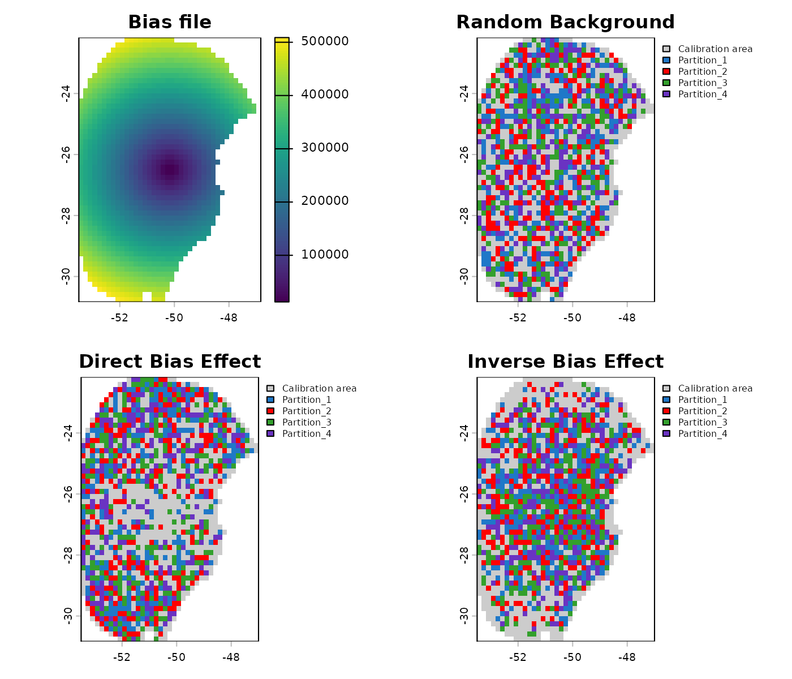
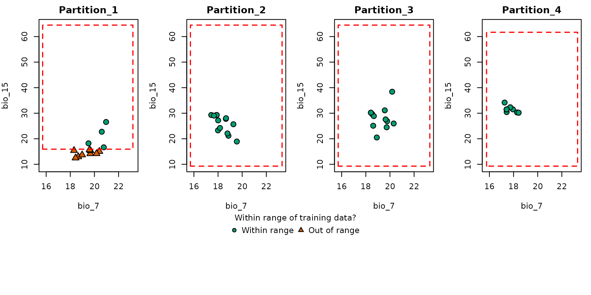
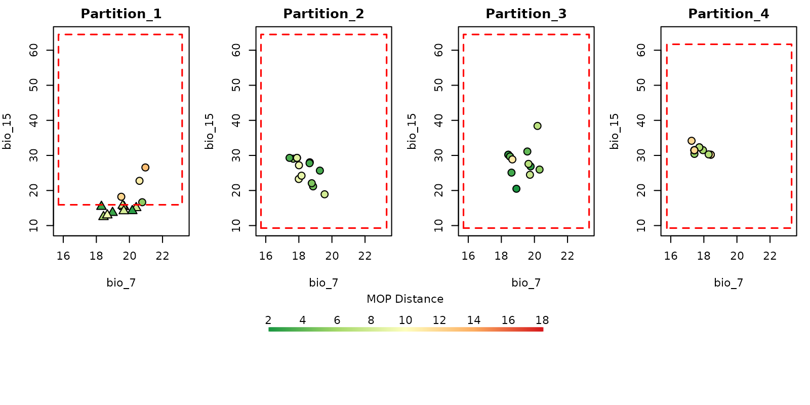

# 2. Prepare Data for Model Calibration

- [Description](#description)
- [Getting ready](#getting-ready)
- [Preparing data](#prepare-data)
  - [Example data](#example-data)
  - [First steps in preparing data](#first-steps-in-preparing-data)
  - [Custom formulas](#custom-formulas)
- [PCA for variables](#pca-for-variables)
  - [Internal PCA](#internal-pca)
  - [External PCA](#external-pca)
- [Preparing user pre-processed data](#prepare-user-pre-processed-data)
- [Exploring calibration data](#exploring-calibration-data)
  - [Histograms to visualize the distribution of predictor
    variables](#histograms-to-visualize-the-distribution-of-predictor-variables)
  - [Spatial-distribution-of-occurrence-and-background-points](#spatial-distribution-of-occurrence-and-background-points)
- [Using a bias file](#using-a-bias-file)
- [Using external data partitions](#using-external-data-partitions)
  - [Spatial partitioning with
    ENMeval](#spatial-partitioning-with-enmeval)
  - [Spatial partitioning with
    flexsdm](#spatial-partitioning-with-flexsdm)
- [Similarity assessment in
  partitions](#similarity-assessment-in-partitions)
- [Saving a prepared_data object](#saving-a-prepared_data-object)

------------------------------------------------------------------------

## Description

Before starting the ENM process, data must be formatted in a specific
structure required by functions in **kuenm2**. This vignette guides
users through the steps necessary to prepare occurrence data and
environmental predictors using built-in tools. It covers the use of
[`prepare_data()`](https://marlonecobos.github.io/kuenm2/reference/prepare_data.md)
and
[`prepare_user_data()`](https://marlonecobos.github.io/kuenm2/reference/prepare_user_data.md)
to generate standardized objects, which are essential for model
calibration. The vignette also demonstrates options for applying PCA to
variables, incorporating sampling bias, integrating external data
partition methods, assess and saving prepared data for later use.

  

## Getting ready

If kuenm2 has not been installed yet, please do so. See the [Main
guide](https://marlonecobos.github.io/kuenm2/index.md) for installation
instructions. See also the [basic data cleaning
guide](https://marlonecobos.github.io/kuenm2/articles/basic_data_cleaning.md)
for some data cleaning steps.

Use the following lines of code to load kuenm2 and any other required
packages, and define a working directory (if needed). In general,
setting a working directory in R is considered good practice, as it
provides better control over where files are read from or saved to. If
users are not working within an R project, we recommend setting a
working directory, since at least one file will be saved at later stages
of this guide.

Note: functions from other packages (i.e., not from base R or kuenm2)
used in this guide will be displayed as `package::function()`.

``` r
# Load packages
library(kuenm2)
library(terra)

# Current directory
getwd()

# Define new directory
#setwd("YOUR/DIRECTORY")  # uncomment and modify if setting a new directory
```

  

## Prepare data

### Example data

We will use occurrence records provided within the kuenm2 package. Most
example data in the package is derived from [Trindade & Marques
(2024)](https://doi.org/10.1111/ddi.13931). The `occ_data` object
contains 51 occurrences of *Myrcia hatschbachii*, a tree endemic to
Southern Brazil. Although this example data set has three columns
(species, x, and y), users’ input data only requires two numeric columns
with longitude and latitude coordinates.

``` r
# Import occurrences
data(occ_data, package = "kuenm2")

# Check data structure
str(occ_data)
#> 'data.frame':    51 obs. of  3 variables:
#>  $ species: chr  "Myrcia hatschbachii" "Myrcia hatschbachii" "Myrcia hatschbachii" "Myrcia hatschbachii" ...
#>  $ x      : num  -51.3 -50.6 -49.3 -49.8 -50.2 ...
#>  $ y      : num  -29 -27.6 -27.8 -26.9 -28.2 ...
```

  

As predictor variables, we will use other data included in the package.
This data set comprises four bioclimatic variables from [WorldClim
2.1](https://worldclim.org/data/bioclim.html) at 10 arc-minute
resolution, and a categorical variable (SoilType) from
[SoilGrids](https://soilgrids.org/) resampled to 10 arc-minutes. All
variables have been masked using a polygon that delimits the area for
model calibration, which was generated by drawing a minimum convex
polygon around the records with a 300 km buffer.

``` r
# Import raster layers
var <- terra::rast(system.file("extdata", "Current_variables.tif", 
                               package = "kuenm2"))

# Check variables
terra::plot(var)
```


  

Visualize occurrences records in geography:

``` r
# Visualize occurrences on one variable
terra::plot(var[["bio_1"]], main = "Bio 1")

points(occ_data[, c("x", "y")], col = "black")
```


  

### First steps in preparing data

The function
[`prepare_data()`](https://marlonecobos.github.io/kuenm2/reference/prepare_data.md)
is central to getting data ready for model calibration. It handles
several key steps:

- **Defining the algorithm**: Users can choose between `maxnet` or
  `glm`.
- **Generating background points**: Background points are sampled from
  raster layers, unless provided by the user. Background points serve as
  a reference to contrast presence records.
- **Principal component analysis (PCA)**: An optional step that can be
  done with the variables provided.
- **Preparing calibration data**: Presence records and background points
  are associate with predictor values and put together in a `data.frame`
  to be used in the ENM.
- **Data partitioning**: The function divides your data to prepare
  training and testing sets via a cross-validation process. The
  partitioning methods available includes `kfolds`, `subsample`, and
  `bootstrap`.
- **Defining grid of model parameters**: This helps setting up
  combinations of feature classes (FCs), regularization multiplier (RM)
  values (for Maxnet), and sets of predictor variables. An explanation
  of the roles of RMs and FCs in Maxent models see [Merow et
  al. 2013](https://doi.org/10.1111/j.1600-0587.2013.07872.x).

As with any function, we recommend consulting the documentation with
[`help(prepare_data)`](https://marlonecobos.github.io/kuenm2/reference/prepare_data.md)
for more detailed explanations. Now, let’s prepare the data for model
calibration, using 4 k-folds to partition training and testing datasets:

``` r
# Prepare data for maxnet model
d <- prepare_data(algorithm = "maxnet",
                  occ = occ_data,
                  x = "x", y = "y",
                  raster_variables = var,
                  species = "Myrcia hatschbachii",
                  categorical_variables = "SoilType", 
                  partition_method = "kfolds", 
                  n_partitions = 4,
                  n_background = 1000,
                  features = c("l", "q", "lq", "lqp"),
                  r_multiplier = c(0.1, 1, 2))
#> Warning in handle_missing_data(occ_bg, weights): 43 rows were excluded from
#> database because NAs were found.
```

  

The
[`prepare_data()`](https://marlonecobos.github.io/kuenm2/reference/prepare_data.md)
function returns a `prepared_data` object, a list that contains several
essential components for model calibration. Below is an example of the
object’s printed output, which provides a summary of its contents.

``` r
print(d)
#> prepared_data object summary
#> ============================
#> Species: Myrcia hatschbachii 
#> Number of Records: 1008 
#>   - Presence: 51 
#>   - Background: 957 
#> Partition Method: kfolds 
#>   - Number of kfolds: 4 
#> Continuous Variables:
#>   - bio_1, bio_7, bio_12, bio_15 
#> Categorical Variables:
#>   - SoilType 
#> PCA Information: PCA not performed
#> Weights: No weights provided
#> Calibration Parameters:
#>   - Algorithm: maxnet 
#>   - Number of candidate models: 300 
#>   - Features classes (responses): l, q, lq, lqp 
#>   - Regularization multipliers: 0.1, 2, 1
```

  

The parts of the `prepared_data` object can be explored in further
detail by indexing them as in the following example.

``` r
# Check the algorithm selected
d$algorithm
#> [1] "maxnet"

# See first rows of calibration data
head(d$calibration_data)
#>   pr_bg    bio_1    bio_7 bio_12   bio_15 SoilType
#> 1     1 16.49046 18.66075   1778 12.96107       19
#> 2     1 15.46644 19.65775   1560 14.14697       19
#> 3     1 15.70560 17.99450   1652 23.27548        6
#> 4     1 17.78899 19.55600   1597 18.91694        1
#> 5     1 15.50116 18.30750   1497 15.39440       19
#> 6     1 17.42421 17.25875   1760 34.17664        6

# See first rows of formula grid
head(d$formula_grid)
#>   ID           Formulas R_multiplier Features
#> 1  1  ~bio_1 + bio_7 -1          0.1        l
#> 2  2  ~bio_1 + bio_7 -1          2.0        l
#> 3  3  ~bio_1 + bio_7 -1          1.0        l
#> 4  4 ~bio_1 + bio_12 -1          2.0        l
#> 5  5 ~bio_1 + bio_12 -1          1.0        l
#> 6  6 ~bio_1 + bio_12 -1          0.1        l
```

  

The algorithms that can be selected are `"maxnet"` or `"glm"`. When
using GLMs, regularization multipliers are not used.

Now, let’s run an example using `glm`, this time using the `subsample`
partitioning method, with 10 replicates and 70% of the dataset used for
training in every replicate.

``` r
# Prepare data selecting GLM as the algorithm
d_glm <- prepare_data(algorithm = "glm",
                      occ = occ_data,
                      x = "x", y = "y",
                      raster_variables = var,
                      species = "Myrcia hatschbachii",
                      categorical_variables = "SoilType", 
                      partition_method = "subsample", 
                      n_partitions = 10, 
                      train_proportion = 0.7,
                      n_background = 300,
                      features = c("l", "q", "p", "lq", "lqp"),
                      r_multiplier = NULL)  # Not necessary with GLMs
#> Warning in handle_missing_data(occ_bg, weights): 8 rows were excluded from
#> database because NAs were found.

# Print object
d_glm
#> prepared_data object summary
#> ============================
#> Species: Myrcia hatschbachii 
#> Number of Records: 343 
#>   - Presence: 51 
#>   - Background: 292 
#> Partition Method: subsample 
#>   - Number of replicates: 
#>   - Train proportion: 0.7 
#> Continuous Variables:
#>   - bio_1, bio_7, bio_12, bio_15 
#> Categorical Variables:
#>   - SoilType 
#> PCA Information: PCA not performed
#> Weights: No weights provided
#> Calibration Parameters:
#>   - Algorithm: glm 
#>   - Number of candidate models: 122 
#>   - Features classes (responses): l, q, p, lq, lqp
```

  

### Custom formulas

By default, *kuenm2* builds the formula grid automatically using the
variables supplied in `raster_variables` together with the selected
features.

For instance, if `raster_variables` contains *bio_1* and *bio_12*, and
you set the features to `lq` (linear + quadratic), the generated formula
will include linear and quadratic terms for each variable. In this
example, the resulting formula would be:

``` r
"~ bio_1 + bio_12 + I(bio_1^2) + I(bio_12^2)"
#> [1] "~ bio_1 + bio_12 + I(bio_1^2) + I(bio_12^2)"
```

However, instead of letting the package build formulas based on the
selected features, you can provide custom formulas. This is useful when
you want full control over which terms are included (for example,
testing only the quadratic version of specific variables):

``` r
# Set custom formulas
my_formulas <- c("~ bio_1 + bio_12 + I(bio_1^2) + I(bio_12^2)",
                 "~ bio_1 + bio_12 + I(bio_1^2)",
                 "~ bio_1 + bio_12 + I(bio_12^2)",
                 "~ bio_1 + I(bio_1^2) + I(bio_12^2)")

# Prepare data using custom formulas
d_custom_formula <- prepare_data(
  algorithm = "maxnet",
  occ = occ_data,
  x = "x", y = "y",
  raster_variables = var,
  species = "Myrcia hatschbachii",
  categorical_variables = "SoilType",
  partition_method = "kfolds",
  n_partitions = 4,
  n_background = 1000,
  user_formulas = my_formulas,  # Custom formulas
  r_multiplier = c(0.1, 1, 2)
)
#> Warning in handle_missing_data(occ_bg, weights): 43 rows were excluded from
#> database because NAs were found.

# Check formula grid
d_custom_formula$formula_grid
#>    ID                                       Formulas R_multiplier Features
#> 1   1 ~ bio_1 + bio_12 + I(bio_1^2) + I(bio_12^2) -1          0.1   User_q
#> 2   2               ~ bio_1 + bio_12 + I(bio_1^2) -1          0.1   User_q
#> 3   3              ~ bio_1 + bio_12 + I(bio_12^2) -1          0.1   User_q
#> 4   4          ~ bio_1 + I(bio_1^2) + I(bio_12^2) -1          0.1   User_q
#> 5   5 ~ bio_1 + bio_12 + I(bio_1^2) + I(bio_12^2) -1          1.0   User_q
#> 6   6               ~ bio_1 + bio_12 + I(bio_1^2) -1          1.0   User_q
#> 7   7              ~ bio_1 + bio_12 + I(bio_12^2) -1          1.0   User_q
#> 8   8          ~ bio_1 + I(bio_1^2) + I(bio_12^2) -1          1.0   User_q
#> 9   9 ~ bio_1 + bio_12 + I(bio_1^2) + I(bio_12^2) -1          2.0   User_q
#> 10 10               ~ bio_1 + bio_12 + I(bio_1^2) -1          2.0   User_q
#> 11 11              ~ bio_1 + bio_12 + I(bio_12^2) -1          2.0   User_q
#> 12 12          ~ bio_1 + I(bio_1^2) + I(bio_12^2) -1          2.0   User_q
```

  

### PCA for variables

A common approach in ENM involves summarizing the information from a set
of predictor variables into a smaller set of uncorrelated variables
using Principal Component Analysis (PCA) (see [Cruz-Cardenaz et
al. 2014](https://doi.org/10.7550/rmb.36723) for an example). In kuenm2
users can perform a PCA internally or use variables that have been
externally prepared as PCs.

  

#### Internal PCA

kuenm2 can perform all PCA transformations internally, which eliminates
the need of transforming raw variables into PCs when producing
projections later on. This is particularly advantageous when projecting
model results across multiple time scenarios (e.g., various Global
Climate Models for different future periods). By performing PCA
internally, you only need to store the raw environmental variables
(e.g., `bio_1`, `bio_2`, etc.) on your directory, and the functions will
handle the PCA transformation as needed.

Let’s explore how to implement this:

``` r
# Prepare data for maxnet models using PCA parameters
d_pca <- prepare_data(algorithm = "maxnet",
                      occ = occ_data,
                      x = "x", y = "y",
                      raster_variables = var, 
                      do_pca = TRUE, center = TRUE, scale = TRUE,  # PCA parameters
                      species = "Myrcia hatschbachii",
                      categorical_variables = "SoilType",
                      n_background = 1000,
                      partition_method = "kfolds",
                      features = c("l", "q", "p", "lq", "lqp"),
                      r_multiplier = c(0.1, 1, 2, 3, 5))
#> Warning in handle_missing_data(occ_bg, weights): 43 rows were excluded from
#> database because NAs were found.

print(d_pca)
#> prepared_data object summary
#> ============================
#> Species: Myrcia hatschbachii 
#> Number of Records: 1008 
#>   - Presence: 51 
#>   - Background: 957 
#> Partition Method: kfolds 
#>   - Number of kfolds: 4 
#> Continuous Variables:
#>   - bio_1, bio_7, bio_12, bio_15 
#> Categorical Variables:
#>   - SoilType 
#> PCA Information:
#>   - Variables included: bio_1, bio_7, bio_12, bio_15 
#>   - Number of PCA components: 4 
#> Weights: No weights provided
#> Calibration Parameters:
#>   - Algorithm: maxnet 
#>   - Number of candidate models: 610 
#>   - Features classes (responses): l, q, p, lq, lqp 
#>   - Regularization multipliers: 0.1, 1, 2, 3, 5
```

  

The elements calibration data and formula grid have now been generated
considering the principal components (PCs). By default, all continuous
variables were included in the PCA, while categorical variables (e.g.,
“SoilType”) were excluded. The default settings for the number of PCs
selected retain the axes that collectively explain 95% of the total
variance, and then further filter these, keeping only those axes that
individually explain at least 5% of the variance. These parameters can
be changed using other arguments in the function `prepare_data`

``` r
# Check calibration data
head(d_pca$calibration_data)
#>   pr_bg         PC1        PC2        PC3         PC4 SoilType
#> 1     1  1.48690341 1.01252697  0.1180156 -0.09119257       19
#> 2     1  1.46028074 0.17701144  1.1573461 -0.12326796       19
#> 3     1  0.82676494 1.21965795  0.8145129 -0.67588891        6
#> 4     1  0.62680441 0.03967459  0.1525997  0.18784282        1
#> 5     1  0.94584897 0.93302089  1.4382424 -0.03192094       19
#> 6     1 -0.07597437 1.55268331 -0.2007953 -0.98153204        6

# Check formula grid
head(d_pca$formula_grid)
#>   ID      Formulas R_multiplier Features
#> 1  1 ~PC1 + PC2 -1          0.1        l
#> 2  2 ~PC1 + PC2 -1          1.0        l
#> 3  3 ~PC1 + PC2 -1          2.0        l
#> 4  4 ~PC1 + PC2 -1          3.0        l
#> 5  5 ~PC1 + PC2 -1          5.0        l
#> 6  6 ~PC1 + PC3 -1          5.0        l

# Explore variables distribution
calib_hist_pca <- explore_calibration_hist(data = d_pca, raster_variables = var,
                                           include_m = TRUE, breaks = 7)

plot_calibration_hist(explore_calibration = calib_hist_pca)
```


As the PCA was performed internally, the `prepared_data` object contains
all the necessary information to transform the raw environmental
variables into the required PCs **This means that when predicting or
projecting models, users should provide raw raster variables**, and the
PCs will be obtained internally in the function.

  

#### External PCA

Alternatively, users can perform a PCA with their data by using the
[`perform_pca()`](https://marlonecobos.github.io/kuenm2/reference/perform_pca.md)
function, or one of their preference. See full documentation with
[`help(perform_pca)`](https://marlonecobos.github.io/kuenm2/reference/perform_pca.md).
Se an example with
[`perform_pca()`](https://marlonecobos.github.io/kuenm2/reference/perform_pca.md)
below:

``` r
pca_var <- perform_pca(raster_variables = var, exclude_from_pca = "SoilType",
                       center = TRUE, scale = TRUE)

# Plot
plot(pca_var$env)
```


  

Now, let’s use the PCs generated by
[`perform_pca()`](https://marlonecobos.github.io/kuenm2/reference/perform_pca.md)
to prepare the data:

``` r
# Prepare data for maxnet model using PCA variables
d_pca_extern <- prepare_data(algorithm = "maxnet",
                             occ = occ_data,
                             x = "x", y = "y",
                             raster_variables = pca_var$env,  # Output of perform_pca()
                             do_pca = FALSE,  # Set to FALSE because variables are PCs
                             species = "Myrcia hatschbachii",
                             categorical_variables = "SoilType", 
                             n_background = 1000, 
                             partition_method = "kfolds",
                             features = c("l", "q", "p", "lq", "lqp"),
                             r_multiplier = c(0.1, 1, 2, 3, 5))
#> Warning in handle_missing_data(occ_bg, weights): 43 rows were excluded from
#> database because NAs were found.

print(d_pca_extern)
#> prepared_data object summary
#> ============================
#> Species: Myrcia hatschbachii 
#> Number of Records: 1008 
#>   - Presence: 51 
#>   - Background: 957 
#> Partition Method: kfolds 
#>   - Number of kfolds: 4 
#> Continuous Variables:
#>   - PC1, PC2, PC3, PC4 
#> Categorical Variables:
#>   - SoilType 
#> PCA Information: PCA not performed
#> Weights: No weights provided
#> Calibration Parameters:
#>   - Algorithm: maxnet 
#>   - Number of candidate models: 610 
#>   - Features classes (responses): l, q, p, lq, lqp 
#>   - Regularization multipliers: 0.1, 1, 2, 3, 5
```

  

Note that since PCA was performed externally, `do_pca = FALSE` is set
within the `prepare_data` function. This is crucial because setting it
to `TRUE` would incorrectly apply PCA to variables that are *already*
PCs. Consequently, the `prepared_data` object in this scenario does not
store any PCA-related information. This means that when users predict or
project models, they must **must provide the PCs** instead of the raw
raster variables.

``` r
# Check calibration data
head(d_pca_extern$calibration_data)
#>   pr_bg         PC1        PC2        PC3         PC4 SoilType
#> 1     1  1.48690341 1.01252697  0.1180156 -0.09119257       19
#> 2     1  1.46028074 0.17701144  1.1573461 -0.12326796       19
#> 3     1  0.82676494 1.21965795  0.8145129 -0.67588891        6
#> 4     1  0.62680441 0.03967459  0.1525997  0.18784282        1
#> 5     1  0.94584897 0.93302089  1.4382424 -0.03192094       19
#> 6     1 -0.07597437 1.55268331 -0.2007953 -0.98153204        6

# Check formula grid
head(d_pca_extern$formula_grid)
#>   ID      Formulas R_multiplier Features
#> 1  1 ~PC1 + PC2 -1          0.1        l
#> 2  2 ~PC1 + PC2 -1          1.0        l
#> 3  3 ~PC1 + PC2 -1          2.0        l
#> 4  4 ~PC1 + PC2 -1          3.0        l
#> 5  5 ~PC1 + PC2 -1          5.0        l
#> 6  6 ~PC1 + PC3 -1          5.0        l
```

  

## Prepare user pre-processed data

If users already have data that has been prepared for calibration, they
can use the
[`prepare_user_data()`](https://marlonecobos.github.io/kuenm2/reference/prepare_user_data.md)
function to create the object required for model calibration.
User-prepared calibration data must be a `data.frame` that includes a
column indicating **presence (1)** and **background (0)** records, along
with columns with values for each of your **variables**. The package
includes an example of such a `data.frame` for reference. See an example
of its use below:

``` r
data("user_data", package = "kuenm2")

head(user_data)
#>   pr_bg    bio_1    bio_7 bio_12   bio_15 SoilType
#> 1     1 16.49046 18.66075   1778 12.96107       19
#> 2     1 15.46644 19.65775   1560 14.14697       19
#> 3     1 15.70560 17.99450   1652 23.27548        6
#> 4     1 17.78899 19.55600   1597 18.91694        1
#> 5     1 15.50116 18.30750   1497 15.39440       19
#> 7     1 17.42421 17.25875   1760 34.17664        6
```

  

The
[`prepare_user_data()`](https://marlonecobos.github.io/kuenm2/reference/prepare_user_data.md)
function operates similarly to
[`prepare_data()`](https://marlonecobos.github.io/kuenm2/reference/prepare_data.md),
but with a key difference: instead of requiring a `data.frame` of
occurrence coordinates and a `SpatRaster` of predictor variables, it
takes your already prepared user `data.frame` (see below). See full
documentation with
[`help(prepare_user_data)`](https://marlonecobos.github.io/kuenm2/reference/prepare_user_data.md).

``` r
# Prepare data for maxnet model
data_user <- prepare_user_data(algorithm = "maxnet",
                               user_data = user_data,  # user-prepared data.frame
                               pr_bg = "pr_bg",
                               species = "Myrcia hatschbachii",
                               categorical_variables = "SoilType",
                               partition_method = "bootstrap",
                               features = c("l", "q", "p", "lq", "lqp"),
                               r_multiplier = c(0.1, 1, 2, 3, 5))

data_user 
#> prepared_data object summary
#> ============================
#> Species: Myrcia hatschbachii 
#> Number of Records: 527 
#>   - Presence: 51 
#>   - Background: 476 
#> Partition Method: bootstrap 
#>   - Number of replicates: 
#>   - Train proportion: 0.7 
#> Continuous Variables:
#>   - bio_1, bio_7, bio_12, bio_15 
#> Categorical Variables:
#>   - SoilType 
#> PCA Information: PCA not performed
#> Weights: No weights provided
#> Calibration Parameters:
#>   - Algorithm: maxnet 
#>   - Number of candidate models: 610 
#>   - Features classes (responses): l, q, p, lq, lqp 
#>   - Regularization multipliers: 0.1, 1, 2, 3, 5
```

This function also allows you to provide a list of index identifying
test points for cross-validation to be used during model calibration. If
`user_folds` is NULL, the function will automatically partition the data
according to the specified `partition_method`, `n_partitions`, and
`train_proportion`.

  

## Exploring calibration data

In the following examples, we’ll use the object `d`, which was prepared
for the `maxnet` algorithm without a mask. The same can be done with
`prepared_data` that uses `glm` as de algorithm.

### Histograms to visualize the distribution of predictor variables

Users can visualize the distribution of predictor values for occurrence
records, background points, and the entire calibration area using
histograms. An example is presented below. See full documentation with
[`help(explore_calibration_hist)`](https://marlonecobos.github.io/kuenm2/reference/explore_calibration_hist.md)
and `help(plot_explore_calibration)`.

``` r
# Prepare histogram data
calib_hist <- explore_calibration_hist(data = d, raster_variables = var,
                                       include_m = TRUE)

# Plot histograms
plot_calibration_hist(explore_calibration = calib_hist)
```


The gray bars represent values across the entire calibration area. Blue
bars indicate background values, while green bars display values at
presence points (magnified by a factor of 2 to enhance visualization).
Both the colors and the magnification factor can be customized.

  

### Spatial distribution of occurrence and background points

Additionally, users can explore the geographic distribution of
occurrence and background points, as well as how they were partitioned.
See full documentation with
[`help(explore_partition_geo)`](https://marlonecobos.github.io/kuenm2/reference/explore_partition_geo.md).

``` r
# Explore spatial distribution
pbg <- explore_partition_geo(data = d, raster_variables = var[[1]])

# Plot exploration in geography
terra::plot(pbg)
```


  

Note that, by default, background points are selected randomly within
the calibration area. However, users can influence the spatial
distribution of background points by providing a bias file, which
increases or decreases the probability of selection in specific regions
(as demonstrated in the section **Using a bias file**).

  

## Using a bias file

A bias file is a `SpatRaster` object that contains values that influence
the selection of background points within the calibration area. This can
be particularly useful for mitigating sampling bias, for instance, by
incorporating the density of records from a target group (as discussed
in [Ponder et
al. 2001](https://doi.org/10.1046/j.1523-1739.2001.015003648.x),
[Anderson et
al. 2003](https://doi.org/10.1046/j.1365-2699.2003.00867.x), and [Barber
et al. 2020](https://doi.org/10.1111/ddi.13442)).

The bias file must have the same extent, resolution, and number of cells
as your raster variables, unless a mask is supplied. If a mask is used,
the extent of the bias file should encompass or be larger than the mask
extent.

Let’s illustrate this with an example bias file included in the package.
This `SpatRaster` has lower values in the center and higher values
towards the borders:

``` r
# Import a bias file
bias <- terra::rast(system.file("extdata", "bias_file.tif", package = "kuenm2"))

terra::plot(bias)
```


  

This bias file will be used to prepare two new datasets: one with a
“direct” bias effect (with higher probability of selecting background
points in regions with higher bias values) and another with an “inverse”
effect (favoring selection in regions with lower bias values).

``` r
# Using a direct bias effect in sampling
d_bias_direct <- prepare_data(algorithm = "maxnet",
                              occ = occ_data,
                              x = "x", y = "y",
                              raster_variables = var,
                              species = "Myrcia hatschbachii",
                              categorical_variables = "SoilType",
                              n_background = 1000, 
                              partition_method = "kfolds",
                              bias_file = bias, bias_effect = "direct",  # bias parameters
                              features = c("l", "q", "p", "lq", "lqp"),
                              r_multiplier = c(0.1, 1, 2, 3, 5))
#> Warning in handle_missing_data(occ_bg, weights): 57 rows were excluded from
#> database because NAs were found.

# Using an indirect bias effect 
d_bias_inverse <- prepare_data(algorithm = "maxnet",
                               occ = occ_data,
                               x = "x", y = "y",
                               raster_variables = var,
                               species = "Myrcia hatschbachii",
                               categorical_variables = "SoilType",
                               n_background = 1000,
                               partition_method = "kfolds",
                               bias_file = bias, bias_effect = "inverse",   # bias parameters
                               features = c("l", "q", "p", "lq", "lqp"),
                               r_multiplier = c(0.1, 1, 2, 3, 5))
#> Warning in handle_missing_data(occ_bg, weights): 45 rows were excluded from
#> database because NAs were found.
```

Let’s use the `explore_partition_geo` function to see the effect of
using a bias file.

``` r

# Explore spatial distribution of points
geo_dist <- explore_partition_geo(data = d, raster_variables = var)
geo_dist_bias <- explore_partition_geo(data = d_bias_direct,
                                       raster_variables = var)
geo_dist_bias_inv <- explore_partition_geo(data = d_bias_inverse,
                                           raster_variables = var)

## Saving original plotting parameters
original_par <- par(no.readonly = TRUE)

## Adjusting plotting grid
par(mfrow = c(2, 2))  

## The plots to show sampling bias effects
plot(bias, main = "Bias file")
plot(geo_dist$Background, main = "Random Background", 
     plg=list(cex=0.75))  # Decrease size of legend text)
plot(geo_dist_bias$Background, main = "Direct Bias Effect", 
     plg=list(cex=0.75))  # Decrease size of legend text)
plot(geo_dist_bias_inv$Background, main = "Inverse Bias Effect", 
     plg=list(cex=0.75))  # Decrease size of legend text)
```



``` r
par(original_par)  # Reset grid
```

  

## Using external data partitions

The functions
[`prepare_data()`](https://marlonecobos.github.io/kuenm2/reference/prepare_data.md)
and
[`prepare_user_data()`](https://marlonecobos.github.io/kuenm2/reference/prepare_user_data.md)
in the `kuenm2` package include four built-in methods for randomly
partitioning data:

- **“kfolds”**: Splits the dataset into *K* subsets (folds) of
  approximately equal size. In each partition, one fold is used as the
  test set, while the remaining folds are combined to form the training
  set.

- **“bootstrap”**: Creates the training dataset by sampling observations
  from the original dataset *with replacement* (i.e., the same
  observation can be selected multiple times). The test set consists of
  the observations that were not selected in that specific replicate.

- **“subsample”**: Similar to bootstrap, but the training set is created
  by sampling *without replacement* (i.e., each observation is selected
  at most once). The test set includes the observations not selected for
  training.

Other methods for data partitioning are also available, including those
based on spatial rules ([Radosavljevic and Anderson,
2014](https://onlinelibrary.wiley.com/doi/pdf/10.1111/jbi.12227)).
Although `kuenm2` does not currently implement spatial partitioning
techniques, it is possible to apply them using other R packages and then
incorporate the resulting partitions into the `prepared_data` object for
model calibration within the `kuenm2` framework.

The
[ENMeval](https://jamiemkass.github.io/ENMeval/articles/ENMeval-2.0-vignette.html#partition)
and
[flexsdm](https://sjevelazco.github.io/flexsdm/articles/v01_pre_modeling.html#data-partitioning)
R packages offers some options. Below, we provide examples on how to
split the data using this packages and include this partition into the
`prepared_data` object to run with `kuenm2`.

### Spatial partitioning with ENMeval

The ENMeval package ([Kass et
al. 2021](https://besjournals.onlinelibrary.wiley.com/doi/pdfdirect/10.1111/2041-210X.13628))
provides three spatial partitioning methods:

- **Spatial block**: Divides occurrence data into four groups based on
  latitude and longitude lines, aiming for groups of roughly equal size.

- **Checkerboard 1 (basic)**: Generates a checkerboard grid over the
  study area and assigns points to groups based on their location in the
  grid.

- **Checkerboard 2 (hierarchical)**: Aggregates the input raster at two
  hierarchical spatial scales using specified aggregation factors.
  Points are then grouped based on their position in the resulting
  hierarchical checkerboard.

As an example, let’s use the **spatial block** method to partition our
dataset. For this example, we will use the object `d`, which corresponds
to the `prepared_data` created in previous steps.

``` r
# Install ENMeval if not already installed
if(!require("ENMeval")){
  install.packages("ENMeval")
}

# Extract calibration data from the prepared_data object and separate presence and background records
calib_occ <- d$data_xy[d$calibration_data$pr_bg == 1,] #Presences
calib_bg <- d$data_xy[d$calibration_data$pr_bg == 0,] #Background

# Apply spatial block partitioning using ENMeval
enmeval_block <- get.block(occs = calib_occ, bg = calib_bg)

# Inspect the structure of the output
str(enmeval_block)
#> List of 2
#>  $ occs.grp: num [1:51] 1 1 2 2 1 4 2 2 4 2 ...
#>  $ bg.grp  : num [1:957] 2 4 4 1 3 3 3 1 1 3 ...
```

Note that the output of `get.block()` is a list with two elements:
`occs.grp` and `bg.grp`. The `occs.grp` vector has the same length as
the number of occurrence records, and `bg.grp` has the same length as
the background points. Both vectors contain numeric values from 1 to 4,
indicating the spatial group to which each point belongs. For example,
an occurrence labeled with `1` belongs to the first spatial block, `2`
to the second block, and so on.

In contrast, `kuenm2` stores partitioned data in a different format: it
expects a **list of vectors**, where each element corresponds to a
partition and contains the **indices of the test points** for that
partition. The indices include both presence and background points.
During model evaluation for each partition, only the presence test
points are used. The background points, although present in the dataset,
are simply excluded from the calibration process.

``` r
str(d$part_data)
#> List of 4
#>  $ Partition_1: num [1:253] 1 3 12 13 14 20 24 25 34 43 ...
#>  $ Partition_2: num [1:252] 5 7 8 10 15 17 23 27 31 33 ...
#>  $ Partition_3: num [1:251] 4 9 19 21 28 29 30 32 35 36 ...
#>  $ Partition_4: num [1:252] 2 6 11 16 18 22 26 37 38 40 ...
```

We can convert the spatial group information stored in `enmeval_block`
into a format compatible with `kuenm2`:

``` r
# Identify unique spatial blocks
id_blocks <- sort(unique(unlist(enmeval_block)))

# Create a list of test indices for each spatial block
new_part_data <- lapply(id_blocks, function(i) {
  # Indices of occurrence records in group i
  rep_i_presence <- which(enmeval_block$occs.grp == i)
  
  # Indices of background records in group i
  rep_i_bg <- which(enmeval_block$bg.grp == i)
  # To get the right indices, we need to sum the number of records
  rep_i_bg <- rep_i_bg + nrow(occ_data)
  
  # Combine presence and background indices for the test set
  c(rep_i_presence, rep_i_bg)
})

# Assign names to each partition
names(new_part_data) <- paste0("Partition_", id_blocks)

# Inspect the structure of the new partitioned data
str(new_part_data)
#> List of 4
#>  $ Partition_1: int [1:406] 1 2 5 12 13 14 15 29 31 42 ...
#>  $ Partition_2: int [1:108] 3 4 7 8 10 16 18 22 27 36 ...
#>  $ Partition_3: int [1:367] 11 19 20 21 24 26 30 33 34 38 ...
#>  $ Partition_4: int [1:127] 6 9 17 23 25 28 32 35 37 39 ...
```

We now have a list containing four vectors, each storing the indices of
test data defined using the `get.block()` function from the `ENMeval`
package. The final step is to replace the original `part_data` in the
`prepared_data` object with `new_part_data`. We should also update the
partitioning method to reflect this change.

``` r
# Replace the original partition data with the new spatial blocks
d_spatial_block <- d
d_spatial_block$part_data <- new_part_data

# Update the partitioning method to reflect the new approach
d_spatial_block$partition_method <- "Spatial block (ENMeval)"  # You can use any descriptive name

# Print the updated prepared_data object
print(d_spatial_block)
#> prepared_data object summary
#> ============================
#> Species: Myrcia hatschbachii 
#> Number of Records: 1008 
#>   - Presence: 51 
#>   - Background: 957 
#> Partition Method: Spatial block (ENMeval) 
#> Continuous Variables:
#>   - bio_1, bio_7, bio_12, bio_15 
#> Categorical Variables:
#>   - SoilType 
#> PCA Information: PCA not performed
#> Weights: No weights provided
#> Calibration Parameters:
#>   - Algorithm: maxnet 
#>   - Number of candidate models: 300 
#>   - Features classes (responses): l, q, lq, lqp 
#>   - Regularization multipliers: 0.1, 2, 1
```

Let’s check the spatial distribution of the partitioned data:

``` r
geo_block <- explore_partition_geo(d_spatial_block, raster_variables = var[[1]])
plot(geo_block[[c("Presence", "Background")]])
```


  

### Spatial partitioning with flexsdm

The `flexsdm` ([Velazco et
al. 2022](https://besjournals.onlinelibrary.wiley.com/doi/full/10.1111/2041-210X.13874))
offers similar spatial partitioning methods. However, it determines the
number or size of bands or blocks based on spatial autocorrelation,
environmental similarity, and the number of presence and background
records within each partition. For more details, please visit the
[package
website](https://sjevelazco.github.io/flexsdm/articles/v01_pre_modeling.html#data-partitioning).

As an example, we will use the Spatial Block method, which evaluates
different raster cell sizes to identify the optimal block configuration
for the dataset.

``` r
# Install flexsdm if not already installed
if (!require("flexsdm")) {
  install.packages("flexsdm")
}

# Combine calibration data with spatial coordinates
calib_data <- cbind(d$data_xy, d$calibration_data)

# Split data in test and train using flexsdm
flexsdm_block <- part_sblock(env_layer = var, data = calib_data, 
                             x = "x", y = "y",
                             pr_ab = "pr_bg", min_res_mult = 1,
                             max_res_mult = 500, num_grids = 30, n_part = 4, 
                             prop = 0.5)
#> The following grid cell sizes will be tested:
#> 0.17 | 3.03 | 5.9 | 8.77 | 11.64 | 14.51 | 17.37 | 20.24 | 23.11 | 25.98 | 
#> 28.84 | 31.71 | 34.58 | 37.45 | 40.32 | 43.18 | 46.05 | 48.92 | 51.79 | 
#> 54.66 | 57.52 | 60.39 | 63.26 | 66.13 | 68.99 | 71.86 | 74.73 | 77.6 | 
#> 80.47 | 83.33
#> 
#> Creating basic raster mask...
#> 
#> Searching for the optimal grid size...

# See the structure of the object
str(flexsdm_block$part)
#> Classes ‘tbl_df’, ‘tbl’ and 'data.frame':    1008 obs. of  4 variables:
#>  $ x    : num  -51.3 -50.6 -49.3 -49.8 -50.2 ...
#>  $ y    : num  -29 -27.6 -27.8 -26.9 -28.2 ...
#>  $ pr_ab: num  1 1 1 1 1 1 1 1 1 1 ...
#>  $ .part: int  3 1 3 2 3 3 1 4 4 3 ...
```

The output from `flexsdm` differs from that of `ENMeval`. Instead of
returning a list with vectors of spatial group IDs for occurrences and
background points separately, `flexsdm` appends the group assignments as
a new column within the `part` element of its output.

As with the ENMeval example, we can transform the spatial group
information stored in `flexsdm_block` into a format compatible with
`kuenm2`:

``` r
# Identify unique spatial blocks from flexsdm output
id_blocks <- sort(unique(flexsdm_block$part$.part))

# Create a list of test indices for each spatial block
new_part_data_flexsdm <- lapply(id_blocks, function(i) {
  # Indices of occurrences and background points in group i
  which(flexsdm_block$part$.part == i)
})

# Assign names to each partition partition
names(new_part_data_flexsdm) <- paste0("Partition_", id_blocks)

# Inspect the structure of the new partitioned data
str(new_part_data_flexsdm)
#> List of 4
#>  $ Partition_1: int [1:248] 2 7 13 21 24 25 26 27 36 40 ...
#>  $ Partition_2: int [1:266] 4 12 15 17 18 19 29 31 32 33 ...
#>  $ Partition_3: int [1:247] 1 3 5 6 10 16 20 28 34 35 ...
#>  $ Partition_4: int [1:247] 8 9 11 14 22 23 30 37 38 41 ...

# Replace the partition data in the prepared_data object
d_block_flexsdm <- d
d_block_flexsdm$part_data <- new_part_data_flexsdm

# Update the partition method description
d_block_flexsdm$partition_method <- "Spatial block (flexsdm)"  # You can choose any descriptive name

# Display the updated prepared_data object
print(d_block_flexsdm)
#> prepared_data object summary
#> ============================
#> Species: Myrcia hatschbachii 
#> Number of Records: 1008 
#>   - Presence: 51 
#>   - Background: 957 
#> Partition Method: Spatial block (flexsdm) 
#> Continuous Variables:
#>   - bio_1, bio_7, bio_12, bio_15 
#> Categorical Variables:
#>   - SoilType 
#> PCA Information: PCA not performed
#> Weights: No weights provided
#> Calibration Parameters:
#>   - Algorithm: maxnet 
#>   - Number of candidate models: 300 
#>   - Features classes (responses): l, q, lq, lqp 
#>   - Regularization multipliers: 0.1, 2, 1
```

Let’s check the spatial distribution of the partitioned data:

``` r
geo_block_flexsdm <- explore_partition_geo(d_block_flexsdm, raster_variables = var[[1]])
plot(geo_block_flexsdm[[c("Presence", "Background")]])
```


  

## Similarity assessment in partitions

When we partition a dataset, some test records may fall in locations
with environmental conditions not represented in the training data. As a
result, model evaluation can occur under extrapolation, meaning the
model is being tested on conditions outside the range it was calibrated
on. The risk of extrapolation increases when spatial blocks are used for
data partitioning. This is because environmental conditions in one
spatial block may differ significantly from those in others. As an
example, let’s use the `prepared_data` object that was partitioned using
spatial blocks from the `ENMeval` package.

The
[`explore_partition_extrapolation()`](https://marlonecobos.github.io/kuenm2/reference/explore_partition_extrapolation.md)
function calculates environmental dissimilarity and detects
non-analogous conditions between training and test data for each
partition using the MOP (Mobility-Oriented Parity) metric ([Owens et
al. 2013](https://doi.org/10.1016/j.ecolmodel.2013.04.011)). It requires
a `prepared_data` object. To visualize the spatial distribution of test
data falling within or outside the training data range, you must also
provide the `raster_variables` used during data preparation.

By default, the function uses all training data (presences and
backgrounds) to define the environmental range but computes MOP only for
test presence records. To also compute MOP for test background points,
set `include_test_background = TRUE`:

``` r
mop_partition <- explore_partition_extrapolation(data = d_spatial_block, 
                                                 include_test_background = T)
```

The function returned a `data.frame` containing:

- **mop_distance**: MOP distances;
- **inside_range** an indicator of whether environmental conditions at
  each test record fall within the training range;
- **n_var_out**: the number of variables outside the training range;
- **towards_low** and **towards_high** : the names of variables with
  values lower or higher than the training range;
- **SoilType**: because the `prepared_data` object includes a
  categorical variable, it also contains a column indicating which
  values in the testing data were not present in the training data.

``` r
# Highlight some partitions with extrapolation risks
head(mop_partition$Mop_results[mop_partition$Mop_results$n_var_out > 1, ])
#>       Partition pr_bg         x         y mop_distance inside_range n_var_out
#> 87  Partition_1     0 -50.75000 -30.75000     12.57765        FALSE         2
#> 129 Partition_1     0 -51.75000 -29.91667     10.91112        FALSE         2
#> 193 Partition_1     0 -53.41667 -27.08333     43.59743        FALSE         2
#> 199 Partition_1     0 -52.41667 -26.75000    171.15194        FALSE         2
#> 252 Partition_1     0 -51.58333 -30.75000     15.76803        FALSE         2
#> 261 Partition_1     0 -53.25000 -27.08333     43.59052        FALSE         2
#>     towards_low towards_high SoilType
#> 87       bio_15         <NA>       21
#> 129      bio_15         <NA>       21
#> 193      bio_15        bio_7     <NA>
#> 199      bio_15       bio_12     <NA>
#> 252      bio_15         <NA>       21
#> 261      bio_15        bio_7     <NA>
```

Now we can use the function `plot_explore_partition` to visualize the
distribution of training presences and testing data in both geographic
and environmental space. The plot type can also be specified: “simple”
indicates whether records in a partition fall within the range of the
other partitions, while “distance” displays the Euclidean distance of
each record to the set of conditions represented in the other
partitions.

``` r
# Simple plot in geographic space
plot_explore_partition(explore_partition = mop_partition, space = "G", 
                       type_of_plot = "simple")
```


``` r

# Distance plot in geographic space
plot_explore_partition(explore_partition = mop_partition, space = "G", 
                       type_of_plot = "distance",
                       lwd_legend = 4)
```


``` r

# Simple plot in environmental space
plot_explore_partition(explore_partition = mop_partition, space = "E", 
                       type_of_plot = "simple", 
                       variables = c("bio_7", "bio_15"))
```



``` r

# Distance plot in environmental space
plot_explore_partition(explore_partition = mop_partition, space = "E", 
                       type_of_plot = "distance",
                       variables = c("bio_7", "bio_15"), 
                       lwd_legend = 4)
```



Note that in Partition 1, some test records fall in locations with
environmental conditions not represented in the training data. This
partition also includes many background points representing conditions
that were not used to calibrate its models.

However, it’s important to mention that this function only identifies
environmental conditions that fall outside the range of the training
data. To fully evaluate the risk of extrapolation, you should look at
the MOP results together with the response curves. This combined
analysis helps to see how the model behaves under those conditions. For
more details, check the [Exploring Model Uncertainty and
Variability](https://marlonecobos.github.io/kuenm2/articles/variability_and_uncertainty.html#comparing-mop-results-with-response-curves)
vignette.

  

## Saving a prepared_data object

The `prepared_data` object is crucial for the next step in the ENM
workflow in kuenm2, model calibration. As this object is essentially a
list, users can save it to a local directory using
[`saveRDS()`](https://rspatial.github.io/terra/reference/serialize.html).
Saving the object facilitates loading it back into your R session later
using
[`readRDS()`](https://rspatial.github.io/terra/reference/serialize.html).
See an example below:

``` r
# Set directory to save (here, in a temporary directory)
dir_to_save <- file.path(tempdir())

# Save the data
saveRDS(d, file.path(dir_to_save, "Data.rds"))

# Import data
d <- readRDS(file.path(dir_to_save, "Data.rds"))
```
