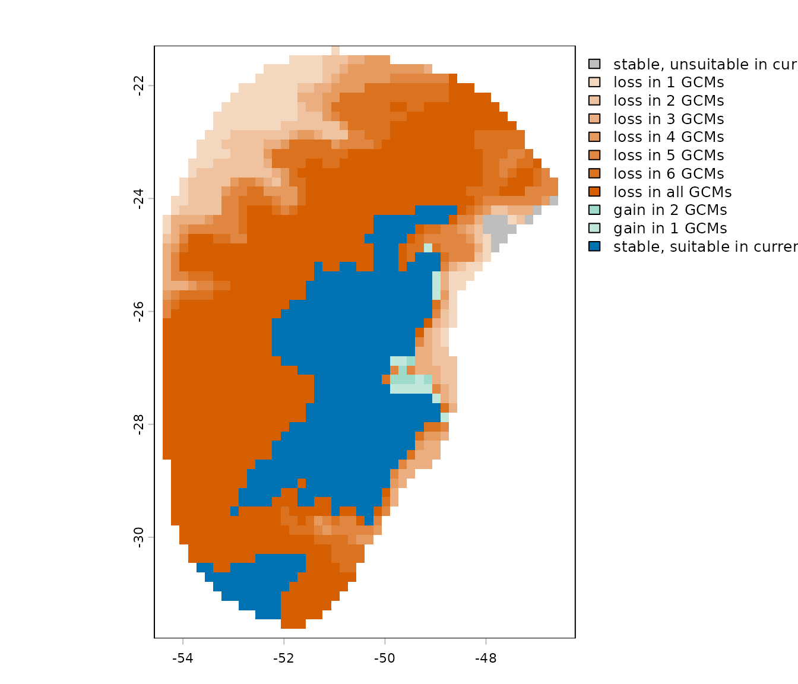

# 8. Example of Projections Using CHELSA Data

## Summary

- [Description](#description)
- [Getting ready](#getting-ready)
- [Naming files for projections](#naming-files-for-projections)
- [Getting variables](#Getting-variables)
  - [Downloading LGM variables](#downloading-lgm-variables)
  - [Downloading current variables](#downloading-current-variables)
  - [Subsetting and renaming](#subsetting-and-renaming)
- [Organizing variables](#organizing-variables)
- [Data preparation for model
  projections](#data-preparation-for-model-projections)
- [Projecting models](#projecting-models)
- [Detecting changes: Past vs
  present](#detecting-changes-past-vs-present)

------------------------------------------------------------------------

## Description

In the vignette [“Project models to multiple
scenarios”](https://marlonecobos.github.io/kuenm2/articles/model_projections.md),
we show how to project models to multiple scenarios at once using future
scenarios available in
[WorldClim](https://worldclim.org/data/cmip6/cmip6climate.html). To
organize WorldClim we previously used the function
([`organize_future_worldclim()`](https://marlonecobos.github.io/kuenm2/reference/organize_future_worldclim.md)),
and we will need to do something similar for data from other databases,
for instance, from [CHELSA](https://www.chelsa-climate.org/).

We need a root directory containing folders representing different
scenarios, and each of these folders stores raster variables. At the
first level, inside the root, folders should correspond to distinct time
periods (e.g., future years like 2070 or past periods such as LGM).
Within each period folder, if applicable, sub-folders can contain data
to represent emission scenarios (e.g., ssp126 and ssp585). Finally,
within each emission scenario or time period folder, a separate folder
for each General Circulation Model (GCM) should be included (e.g.,
BCC-CSM2-MR and MIROC6).

Organizing information this way can be a little tedious, but here we
will show how to do it. This will make possible to project models using
scenarios available in different sources. We will use variables from
CHELSA representing scenarios for the *Last Glacial Maximum* (LGM,
~21,000 year ago).

  

**WARNING:** In November 2025, CHELSA updated its website and LGM
variables have not been listed the way they were before. We keep this
example because the layers are still available to download using the
code below, and users can still see how the function handles past
projections. Please be aware that the download links for these variables
might change in the future, and the code will stop working.

  

  

## Getting ready

At this point it is assumed that `kuenm2` is installed (if not, see the
[Main guide](https://marlonecobos.github.io/kuenm2/articles/index.md)).
Load `kuenm2` and any other required packages, and define a working
directory (if needed).

Note: functions from other packages (i.e., not from base R or `kuenm2`)
used in this guide will be displayed as `package::function()`.

``` r
# Load packages
library(kuenm2)
library(terra)

# Current directory
getwd()

# Define new directory
#setwd("YOUR/DIRECTORY")  # uncomment and modify if setting a new directory
```

  

## Naming files for projections

To start, climate variables must be saved as separate TIF files, one
file per scenario. File names should follow a consistent pattern that
clearly indicates the time period, GCM, and, for future scenarios, the
emission scenario (SSP). In addition, variables should have the same
name across all scenarios. For example:

- A file representing past conditions for the “LGM” period using the
  “MIROC6” GCM could be named “Past_LGM_MIROC6.tif”.
- A file representing future conditions for the period “2081–2100” under
  the emission scenario “ssp585” and the GCM “ACCESS-CM2” could be named
  “Future_2081-2100_ssp585_ACCESS-CM2.tif”.
- Variable names in all files representing scenarios must match (e.g.,
  bio1, bio2, etc.). Units in which variables are measured should match
  among all scenarios.

Let’s see how to achieve this in practice.

  

## Getting variables

### Downloading LGM variables

The first step is downloading raster layers representing LGM conditions.
You can download the files directly using the links we create below, or
following the script.

``` r
# Define variables to download
var_to_use <- c("BIO_01", "BIO_07", "BIO_12", "BIO_15")

# Define GCMs
gcms <- c("CCSM4", "CNRM-CM5", "FGOALS-g2", "IPSL-CM5A-LR", "MIROC-ESM",
          "MPI-ESM-P", "MRI-CGCM3")

# Create a grid combining variables and GCMs
g <- expand.grid("gcm" = gcms, "var" = var_to_use)

# Create links to download
l <- do.call(paste, c(g, sep = "_"))
l <- paste0("https://os.zhdk.cloud.switch.ch/chelsav1/pmip3/bioclim/CHELSA_PMIP_",
            l, ".tif")

# See links
head(l)
#> [1] "https://os.zhdk.cloud.switch.ch/chelsav1/pmip3/bioclim/CHELSA_PMIP_CCSM4_BIO_01.tif"       
#> [2] "https://os.zhdk.cloud.switch.ch/chelsav1/pmip3/bioclim/CHELSA_PMIP_CNRM-CM5_BIO_01.tif"    
#> [3] "https://os.zhdk.cloud.switch.ch/chelsav1/pmip3/bioclim/CHELSA_PMIP_FGOALS-g2_BIO_01.tif"   
#> [4] "https://os.zhdk.cloud.switch.ch/chelsav1/pmip3/bioclim/CHELSA_PMIP_IPSL-CM5A-LR_BIO_01.tif"
#> [5] "https://os.zhdk.cloud.switch.ch/chelsav1/pmip3/bioclim/CHELSA_PMIP_MIROC-ESM_BIO_01.tif"   
#> [6] "https://os.zhdk.cloud.switch.ch/chelsav1/pmip3/bioclim/CHELSA_PMIP_MPI-ESM-P_BIO_01.tif"

# Create a directory to save the raw variables
raw_past_chelsa <- file.path(tempdir(), "Raw_past")  # Here, in a temporary directory
dir.create(raw_past_chelsa)

# Download files and save in the Raw_past directory
options(timeout = 300)  # To avoid errors with timeout
sapply(l, function(i) {
  downfile <- file.path(raw_past_chelsa, basename(i))
  
  # Download only if the file has not been downloaded yet
  if(!file.exists(downfile)) {
      download.file(url = i, destfile = downfile, method = "curl")
  }
})  # It will take a while

#Check the files in the Raw_past
list.files(raw_past_chelsa)
#> [1] "CHELSA_PMIP_CCSM4_BIO_01.tif"        "CHELSA_PMIP_CCSM4_BIO_07.tif"
#> [3] "CHELSA_PMIP_CCSM4_BIO_12.tif"        "CHELSA_PMIP_CCSM4_BIO_15.tif"
#> [5] "CHELSA_PMIP_CNRM-CM5_BIO_01.tif"     "CHELSA_PMIP_CNRM-CM5_BIO_07.tif"
#> [7] "CHELSA_PMIP_CNRM-CM5_BIO_12.tif"     "CHELSA_PMIP_CNRM-CM5_BIO_15.tif"
#> [9] "CHELSA_PMIP_FGOALS-g2_BIO_01.tif"    "CHELSA_PMIP_FGOALS-g2_BIO_07.tif"
#> [11] "CHELSA_PMIP_FGOALS-g2_BIO_12.tif"    "CHELSA_PMIP_FGOALS-g2_BIO_15.tif"
#> [13] "CHELSA_PMIP_IPSL-CM5A-LR_BIO_01.tif" "CHELSA_PMIP_IPSL-CM5A-LR_BIO_07.tif"
#> [15] "CHELSA_PMIP_IPSL-CM5A-LR_BIO_12.tif" "CHELSA_PMIP_IPSL-CM5A-LR_BIO_15.tif"
#> [17] "CHELSA_PMIP_MIROC-ESM_BIO_01.tif"    "CHELSA_PMIP_MIROC-ESM_BIO_07.tif"
#> [19] "CHELSA_PMIP_MIROC-ESM_BIO_12.tif"    "CHELSA_PMIP_MIROC-ESM_BIO_15.tif"
#> [21] "CHELSA_PMIP_MPI-ESM-P_BIO_01.tif"    "CHELSA_PMIP_MPI-ESM-P_BIO_07.tif"
#> [23] "CHELSA_PMIP_MPI-ESM-P_BIO_12.tif"    "CHELSA_PMIP_MPI-ESM-P_BIO_15.tif"
#> [25] "CHELSA_PMIP_MRI-CGCM3_BIO_01.tif"    "CHELSA_PMIP_MRI-CGCM3_BIO_07.tif"
#> [27] "CHELSA_PMIP_MRI-CGCM3_BIO_12.tif"    "CHELSA_PMIP_MRI-CGCM3_BIO_15.tif"
```

  

### Downloading current variables

We also need the variables representing current conditions. You can
download the files directly from [this
link](https://www.chelsa-climate.org/datasets), or follow the script
below:

``` r
# Create directory to save the variables
present_dir <- file.path(tempdir(), "Present_raw")
dir.create(present_dir)

# Define variables to download
var_present <-  c("bio1", "bio7", "bio12", "bio15")

# Create links, download and save in the Present_raw directory
l_present <- sapply(var_present, function(i){
  # Create link to download
  l_present_i <- paste0("https://os.zhdk.cloud.switch.ch/chelsav2/GLOBAL/climatologies/1981-2010/bio/CHELSA_", 
                        i, "_1981-2010_V.2.1.tif")
  
  # Donwload only if the file has not been downloaded yet
  if(!file.exists(file.path(present_dir, basename(l_present_i))))
  download.file(url = l_present_i,
                destfile = file.path(present_dir, basename(l_present_i)),
                method = "curl")
})  # This might take a while

# Check the files in the directory
list.files(present_dir)
#> [1] "CHELSA_bio1_1981-2010_V.2.1.tif"     "CHELSA_bio12_1981-2010_V.2.1.tif"
#> [3] "CHELSA_bio15_1981-2010_V.2.1.tif"    "CHELSA_bio7_1981-2010_V.2.1.tif"
```

  

### Subsetting and renaming

After downloading files, we need to combine all variables for each
scenario in a single TIF file. In general, past scenarios differs only
in terms of GCM, while future scenarios are also separated according to
different emission scenarios (i.e., SSP1-26 and SSP5-85) and GCMs.

First, let’s combine the variables from the present scenario. To speed
up the analysis in this example, we will also resample the raster layers
from 30 arc-seconds to 10 arc-minutes, and crop the variables using a
calibration area (provided as example data with the package). We will
also rename the variables as follows “bio1”, “bio12”, “bio15”, and
“bio7”.

``` r
# Import are for model calibration (M)
m <- vect(system.file("extdata", "m.gpkg", 
                        package = "kuenm2"))

# Import present variables
present_files <- list.files(present_dir, full.names = TRUE)  # List files
present_var <- rast(present_files)

# Mask variables using the calibration area (m)
present_m <- crop(present_var, m, mask = TRUE)

# Check variables names
names(present_m)
#> [1] "CHELSA_bio1_1981-2010_V.2.1"  "CHELSA_bio12_1981-2010_V.2.1"
#> [3] "CHELSA_bio15_1981-2010_V.2.1" "CHELSA_bio7_1981-2010_V.2.1"

# Rename variables
names(present_m) <- c("bio1", "bio12", "bio15", "bio7")
names(present_m)
#> [1] "bio1"  "bio12" "bio15" "bio7"

# Check current resolution (30arc-sec)
res(present_m)
#> [1] 0.008333333 0.008333333

# Decrease resolution to 10arc-min
present_chelsa <- aggregate(present_m, fact = 20, fun = "mean")

# Save processed raster
dir_current <- file.path(tempdir(), "Current_CHELSA")
dir.create(dir_current)

writeRaster(present_chelsa, 
            filename = file.path(dir_current, "Current_CHELSA.tif"))
```

  

Now, let’s do the same with variables representing LGM conditions:

``` r
# Import LGM variables
lgm_files <- list.files(raw_past_chelsa, full.names = TRUE)  # List files
lgm_var <- rast(lgm_files)

# Mask variables using the calibration area (m)
lgm_m <- crop(lgm_var, m, mask = TRUE)

# Decrease resolution to 10arc-min
lgm_chelsa <- aggregate(lgm_m, fact = 20, fun = "mean")

# Check variables names
names(lgm_chelsa)
#>  [1] "CHELSA_PMIP_CCSM4_BIO_01"        "CHELSA_PMIP_CCSM4_BIO_07"       
#>  [3] "CHELSA_PMIP_CCSM4_BIO_12"        "CHELSA_PMIP_CCSM4_BIO_15"       
#>  [5] "CHELSA_PMIP_CNRM-CM5_BIO_01"     "CHELSA_PMIP_CNRM-CM5_BIO_07"    
#>  [7] "CHELSA_PMIP_CNRM-CM5_BIO_12"     "CHELSA_PMIP_CNRM-CM5_BIO_15"    
#>  [9] "CHELSA_PMIP_FGOALS-g2_BIO_01"    "CHELSA_PMIP_FGOALS-g2_BIO_07"   
#> [11] "CHELSA_PMIP_FGOALS-g2_BIO_12"    "CHELSA_PMIP_FGOALS-g2_BIO_15"   
#> [13] "CHELSA_PMIP_IPSL-CM5A-LR_BIO_01" "CHELSA_PMIP_IPSL-CM5A-LR_BIO_07"
#> [15] "CHELSA_PMIP_IPSL-CM5A-LR_BIO_12" "CHELSA_PMIP_IPSL-CM5A-LR_BIO_15"
#> [17] "CHELSA_PMIP_MIROC-ESM_BIO_01"    "CHELSA_PMIP_MIROC-ESM_BIO_07"   
#> [19] "CHELSA_PMIP_MIROC-ESM_BIO_12"    "CHELSA_PMIP_MIROC-ESM_BIO_15"   
#> [21] "CHELSA_PMIP_MPI-ESM-P_BIO_01"    "CHELSA_PMIP_MPI-ESM-P_BIO_07"   
#> [23] "CHELSA_PMIP_MPI-ESM-P_BIO_12"    "CHELSA_PMIP_MPI-ESM-P_BIO_15"   
#> [25] "CHELSA_PMIP_MRI-CGCM3_BIO_01"    "CHELSA_PMIP_MRI-CGCM3_BIO_07"   
#> [27] "CHELSA_PMIP_MRI-CGCM3_BIO_12"    "CHELSA_PMIP_MRI-CGCM3_BIO_15"
```

  

Note that file names contain the information on the GCM. The trick here
is using these patterns for grouping the variables:

``` r
# In each iteration, 'i' is a GCM
lgm_by_gcm <- lapply(gcms, function(i){
  # Subset variables that belong to GCM i
  lgm_gcm_i <- lgm_chelsa[[grepl(i, names(lgm_chelsa))]]
  
  # Rename variables
  names(lgm_gcm_i) <- c("bio1", "bio7", "bio12", "bio15")
  return(lgm_gcm_i)
})

names(lgm_by_gcm) <- gcms
```

  

One important thing to note is that variables from LGM have different
units compared to the current ones. In the current time, bio_1 have
values in ºC, while in the LGM it has values in K \* 10. bio_7 have
values in ºC in the current time and in ºC \* 10 in LGM. The current
precipitation variables are in millimeters (mm) or percentage of
variation (bio_15), while in the LGM they are in mm \* 10 or % \* 10.

``` r
# Check values of variables in present
#> minmax(present_chelsa[[c("bio1", "bio7", "bio12", "bio15")]])
#>         bio1     bio7    bio12    bio15
#> min 12.87700 10.11300 1211.605 10.32925
#> max 24.70025 21.06125 3063.049 70.45125

# Check values of variables in LGM (CCSM4)
minmax(lgm_by_gcm$CCSM4)
#>         bio1     bio7    bio12    bio15
#> min 2822.425 173.5125 10710.62  86.9125
#> max 2946.758 219.7700 23159.20 659.0025
```

  

We need to convert these variables so they have the same units as the
current variables:

``` r
# Fixing units in loop
lgm_fixed_units <- lapply(lgm_by_gcm, function(x) {
  x$bio1 <- (x$bio1 / 10) - 273  # Divide by 10 and subtracts -273
  x$bio7 <- x$bio7 / 10  # Divide by 10
  x$bio12 <- x$bio12 / 10  # Divide by 10
  x$bio15 <- x$bio15 / 10  # Divide by 10
  return(x)
})

# Check units
minmax(lgm_fixed_units$CCSM4)
#>         bio1     bio7    bio12    bio15
#> min  9.24250 17.35125 1071.062  8.69125
#> max 21.67575 21.97700 2315.920 65.90025
```

  

Now that we have the variables for LGM grouped by GCMs, with names and
units fixed accordingly, we can write the files to disk. Remember that
file names must include the time period (LGM) and the GCM of each
scenario:

``` r
# Create directory to save processed lgm variables
dir_lgm <- file.path(tempdir(), "LGM_CHELSA")
dir.create(dir_lgm)

# Processing in loop
lapply(names(lgm_fixed_units), function(i) {
  # Subset SpatRaster from GCM i
  r_i <- lgm_fixed_units[[i]]
  
  # Name the file with the Period (LGM) and GCM (i)
  filename_i <- paste0("CHELSA_LGM_", i, ".tif") 
  
  # Write Raster
  writeRaster(r_i, filename = file.path(dir_lgm, filename_i))
})
```

  

## Organizing variables

At this points we have:

- The variables stored as TIF files, one file per scenario.
- The names of files containing patterns to identify the time periods
  and GCMS.
- The variable names (bio1, bio2, etc.) matching across scenarios.

Now, we can use the function
[`organize_for_projection()`](https://marlonecobos.github.io/kuenm2/reference/organize_for_projection.md)
to organize the files in the specific hierarchical manner compatible
with `kuenm2`. The function requires:

- `present_file`, `past_files` and/or `future_files`: character vector
  with the *full path* to the files for the scenarios of interest. When
  listing these files, is important to set `full.names = TRUE` in
  [`list.files()`](https://rdrr.io/r/base/list.files.html).
- `past_period` and/or `future_period`: character vector specifying the
  time periods in past and/or future, respectively. Examples of past
  periods are *LGM* and *MID*. Examples of future periods include
  *2061-2080* or *2100*. *Remember that period ID needs to be part of
  file names*.
- `past_gcm` and/or `future_gcm`: character vector specifying GCMS in
  past and/or future, respectively. Examples of GCMS are *CCSM4* and
  *FGOALS-g2*. *Remember that GCMs need to be part of file names*.
- `future_pscen`: character vector specifying emission scenarios in the
  future. Examples of scenario names are *ssp126* and *ssp585*.
  *Remember that scenarios need to be part of file names*.
- `variables_names` or `models`: a character vector with the variable
  names or a `fitted_model` object (from where the variables used in the
  model will be extracted).

The function also allows to use a spatial object (`SpatVector`,
`SpatRaster`, or `SpatExtent`) to mask the variables, and append names
of static variables (i.e., topographic variables) to the climatic
variables.

first step is using `list.files(path, full.names = TRUE)` to list the
path to the files representing present and LGM conditions. Remember, we
save the processed current variables in the `present_dir` directory and
the LGM variables in `dir_lgm`:

``` r
# Listing files in directories
present_list <- list.files(path = dir_current, pattern = "Current_CHELSA",
                           full.names = TRUE)

lgm_list <- list.files(path = dir_lgm, pattern = "LGM", full.names = TRUE)
```

  

Let’s check the listed files to ensure they are storing the full path to
the variables of each scenario:

``` r
# Check list of files with full paths
## Present
present_list  # Paths can be different in distinct computers
#> "Local\\Temp\\Current_CHELSA.tif"

# Past
lgm_list  # Paths can be different in distinct computers
#> [1] "Local\\Temp\\CHELSA_LGM_CCSM4.tif"       
#> [2] "Local\\Temp\\CHELSA_LGM_CNRM-CM5.tif"    
#> [3] "Local\\Temp\\CHELSA_LGM_FGOALS-g2.tif"   
#> [4] "Local\\Temp\\CHELSA_LGM_IPSL-CM5A-LR.tif"
#> [5] "Local\\Temp\\CHELSA_LGM_MIROC-ESM.tif"   
#> [6] "Local\\Temp\\CHELSA_LGM_MPI-ESM-P.tif"   
#> [7] "Local\\Temp\\CHELSA_LGM_MRI-CGCM3.tif"
```

  

After checking files, we are ready to organize them:

``` r
# Create a directory to save the variables
# Here, in a temporary directory. Change to your work directory in your computer
out_dir <- file.path(tempdir(), "Projection_variables")

# Organizing files the way it is needed
organize_for_projection(output_dir = out_dir, 
                        variable_names = c("bio1", "bio7", "bio12", "bio15"), 
                        present_file = present_list, 
                        past_files = lgm_list, 
                        past_period = "LGM", 
                        past_gcm = c("CCSM4", "CNRM-CM5", "FGOALS-g2", 
                                     "IPSL-CM5A-LR", "MIROC-ESM", "MPI-ESM-P",
                                     "MRI-CGCM3"),
                        resample_to_present = TRUE,
                        overwrite = TRUE)
#> 
#> Variables successfully organized in directory:
#> /tmp/Rtmpxec8aF/Projection_variables
```

  

We can check the files structured hierarchically in nested folders using
the [`dir_tree()`](https://fs.r-lib.org/reference/dir_tree.html)
function from the `fs` package:

``` r
# Install package if necessary
if(!require("fs")) {
  install.packages("fs")
}

fs::dir_tree(out_dir)
#> Local\Temp\Projection_variables
#> ├── Past
#> │   └── LGM
#> │       ├── CCSM4
#> │       │   └── Variables.tif
#> │       ├── CNRM-CM5
#> │       │   └── Variables.tif
#> │       ├── FGOALS-g2
#> │       │   └── Variables.tif
#> │       ├── IPSL-CM5A-LR
#> │       │   └── Variables.tif
#> │       ├── MIROC-ESM
#> │       │   └── Variables.tif
#> │       ├── MPI-ESM-P
#> │       │   └── Variables.tif
#> │       └── MRI-CGCM3
#> │           └── Variables.tif
#> └── Present
#>     └── Variables.tif
```

  

After organizing variables, the next step is to create the
`prepared_projection` object.

But before this, let’s import a `fitted_model` object provided as
example data in `kuenm2`. This object was created in a process that used
current variables from CHELSA. For more information check the vignettes
about [data
preparation](https://marlonecobos.github.io/kuenm2/articles/prepare_data.md),
[model
calibration](https://marlonecobos.github.io/kuenm2/articles/model_calibration.md)
and [model
exploration](https://marlonecobos.github.io/kuenm2/articles/model_exploration.md).

``` r
# Load the object with fitted models
data(fitted_model_chelsa, package = "kuenm2")
```

  

## Data preparation for model projections

Now, let’s prepare data for model projections to multiple scenarios. We
need the paths to the folders where the raster files are stored.

In addition to storing the paths to the variables for each scenario, the
function verifies if all variables used to fit the final models are
present across all scenarios. To perform this check, you need to provide
either the `fitted_models` object you intend to use for projection or
simply the variable names. We strongly suggest using the `fitted_models`
object to minimize errors.

We also need to provide information so the function can identify time
periods, SSPs, and GCMs (no SSPs in this example).

``` r
# Define present_dir and past_dir
in_dir_present <- file.path(out_dir, "Present")
in_dir_past <- file.path(out_dir, "Past")

# Prepare projections using fitted models to check variables
pr <- prepare_projection(models = fitted_model_chelsa,
                         present_dir = in_dir_present,  # Directory with present variables
                         past_dir = in_dir_past, 
                         past_period = "LGM", 
                         past_gcm = c("CCSM4", "CNRM-CM5", "FGOALS-g2", 
                                      "IPSL-CM5A-LR", "MIROC-ESM", "MPI-ESM-P",
                                      "MRI-CGCM3"), 
                         future_dir = NULL,  # NULL because we won't project to the Future
                         future_period = NULL, 
                         future_pscen = NULL,  
                         future_gcm = NULL)  
```

  

When we print the `projection_data` object, it summarizes all scenarios
we will predict to, and shows the root directory where the files are
stored:

``` r
pr
#> projection_data object summary
#> ==============================
#> Variables prepared to project models for Present and Past 
#> Past projections contain the following periods and GCMs:
#>   - Periods: LGM 
#>   - GCMs: CCSM4 | CNRM-CM5 | FGOALS-g2 | IPSL-CM5A-LR | MIROC-ESM | MPI-ESM-P | MRI-CGCM3 
#> All variables are located in the following root directory:
#> Local/Temp/Projection_variables
```

  

## Projecting models

After preparing the data, we can use the
[`project_selected()`](https://marlonecobos.github.io/kuenm2/reference/project_selected.md)
function to project selected models across the scenarios specified
before. For a comprehensive explanation of this step, please see the
[Project models to multiple
scenarios](https://marlonecobos.github.io/kuenm2/articles/model_projections.md)
vignette.

``` r
# Create a folder to save projection results
# Here, in a temporary directory
out_dir_projections <- file.path(tempdir(), "Projection_results/chelsa")
dir.create(out_dir_projections, recursive = TRUE)

# Project selected models to multiple scenarios
p <- project_selected(models = fitted_model_chelsa, 
                      projection_data = pr,
                      out_dir = out_dir_projections, 
                      write_replicates = TRUE,
                      progress_bar = FALSE,  # Do not print progress bar
                      overwrite = TRUE)

# Import mean of each projected scenario
p_mean <- import_results(projection = p, consensus = "mean")

# Plot all scenarios
terra::plot(p_mean, cex.main = 0.8)
```


  

## Detecting changes: Past vs present

When projecting a model to different temporal scenarios (past or
future), changes in suitable areas can be classified into three
categories relative to the current baseline: **gain**, **loss** and
**stability**. The interpretation of these categories depends on the
temporal direction of the projection.

**When projecting to future scenarios**:

- *Gain*: Areas currently unsuitable become suitable in the future.
- *Loss*: Areas currently suitable become unsuitable in the future.
- *Stability*: Areas remain the same in the future, suitable or
  unsuitable.

**When projecting to past scenarios**:

- *Gain*: Areas unsuitable in the past are suitable in the present.
- *Loss*: Areas suitable in the past are unsuitable in the present.
- *Stability*: Areas remain the same in the present, suitable or
  unsuitable.

These outcomes may vary across different General Circulation Models
(GCMs) within each time scenario (e.g., various Shared Socioeconomic
Pathways (SSPs) for the same period).

The
[`projection_changes()`](https://marlonecobos.github.io/kuenm2/reference/projection_changes.md)
function summarizes the number of GCMs predicting gain, loss, and
stability for each time scenario.

By default, this function writes the summary results to disk (unless
`write_results` is set to `FALSE`), but it does not save binary layers
for individual GCMs. In the example below, we demonstrate how to
configure the function to return the raster layers with changes and
write the binary results to disk.

Here, we present an example of detected changes from LGM to current
conditions.

``` r
# Run function to detect changes
changes <- projection_changes(model_projections = p, consensus = "mean",
                              output_dir = out_dir_projections, 
                              write_bin_models = TRUE,  # Write individual binary results
                              return_raster = TRUE, overwrite = TRUE)

# Set colors
summary_with_colors <- colors_for_changes(changes_projections = changes)

# Plot
terra::plot(summary_with_colors$Summary_changes)
```



  

In this example, we can see that the species has lost a lot of its
suitable area when comparing LGM to present-day conditions. This is
supported by the high agreement among GCMs.
