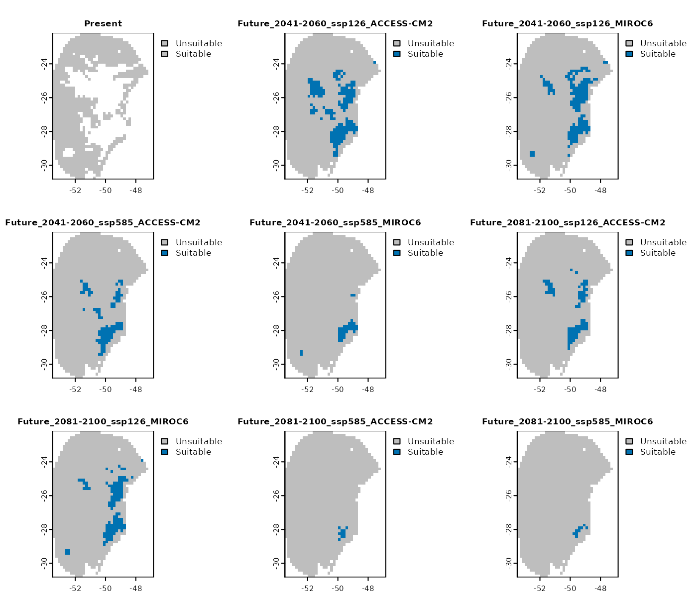
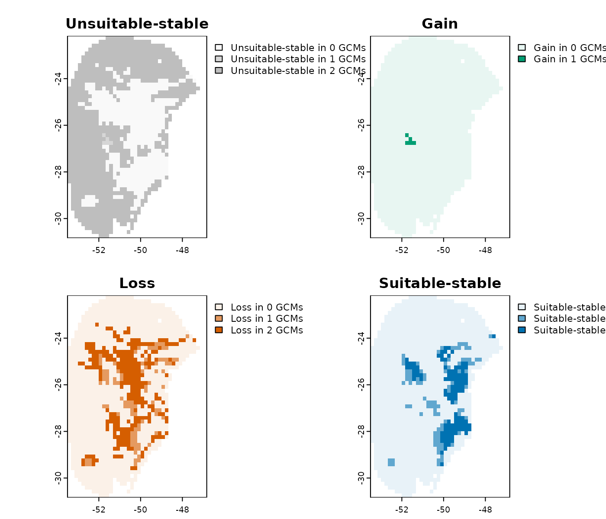

# Exploring Model Uncertainty and Variability

## Summary

- [Introduction](#introduction)
- [Compute Changes Between
  Scenarios](#compute-changes-between-scenarios)
  - [Set Colors for Change Maps](#set-colors-for-change-maps)
  - [Types os results](#types-os-results)
  - [Importing Results](#importing-results)
  - [Save changes_projections](#save-changes_projections)
- [Explore Variance](#explore-variance)
  - [Importing Results](#importing-results-1)
  - [Saving the variability_projections
    Object](#saving-the-variability_projections-object)
- [Analyze Extrapolation Risks Using the MOP
  Metric](#analyze-extrapolation-risks-using-the-mop-metric)
  - [MOP types](#mop-types)
    - [Distances](#distances)
    - [Basic](#basic)
    - [Simple](#simple)
    - [Combined Towards High/Low](#combined-towards-highlow)
    - [Towards High/Low End](#towards-highlow-end)
  - [Handling In-Range Values: NA or
    Zero](#handling-in-range-values-na-or-zero)
  - [Comparing MOP Results with Response
    Curves](#comparing-mop-results-with-response-curves)
  - [Saving and Importing MOP
    Results](#saving-and-importing-mop-results)

## Introduction

After projecting models across multiple scenarios using the
[`project_selected()`](https://marlonecobos.github.io/kuenm2/reference/project_selected.md)
function, several types of analyses can be performed:

- **Compute changes** between scenarios using the
  [`projection_changes()`](https://marlonecobos.github.io/kuenm2/reference/projection_changes.md)
  function.
- **Explore variability** arising from partitions, model
  parameterizations, and General Circulation Models (GCMs) with
  [`projection_variability()`](https://marlonecobos.github.io/kuenm2/reference/projection_variability.md).
- **Assess extrapolation risks** through analysis with
  [`projection_mop()`](https://marlonecobos.github.io/kuenm2/reference/projection_mop.md).

These analyses require a `model_projections` object, which is the output
of
[`project_selected()`](https://marlonecobos.github.io/kuenm2/reference/project_selected.md).
This object contains the predicted scenario data as well as the
directory paths where the projection rasters are saved.

To create this object, follow the steps outlined below and described in
the [“Project models to multiple
scenarios”](https://marlonecobos.github.io/kuenm2/articles/model_projections.md)
vignette.

``` r
#Load packages
library(kuenm2)
library(terra)
#> terra 1.8.86

#Import calib_results_maxnet
data("fitted_model_maxnet", package = "kuenm2")

# Import path to raster files with future predictors provided as example
# The data is located in the "inst/extdata" folder.
in_dir <- system.file("extdata", package = "kuenm2")

# Import raster layers (same used to calibrate and fit final models)
var <- rast(system.file("extdata", "Current_variables.tif", package = "kuenm2"))
#Get soilType
soiltype <- var$SoilType

# Organize and structure WorldClim files
#Create folder to save structured files
out_dir_future <- file.path(tempdir(), "Future_raw") #Here, in a temporary directory
#Organize
organize_future_worldclim(input_dir = in_dir, #Path to the raw variables from WorldClim
                          output_dir = out_dir_future, 
                          name_format = "bio_", #Name format
                          fixed_variables = var$SoilType, #Static variables
                          progress_bar = FALSE, overwrite = TRUE)
#> 
#> Variables successfully organized in directory:
#> /tmp/RtmpjMdCIC/Future_raw

# Create a "Current_raw" folder in a temporary directory
#and copy the rawvariables there.
out_dir_current <- file.path(tempdir(), "Current_raw")
dir.create(out_dir_current, recursive = TRUE)

# Save current variables in temporary directory
terra::writeRaster(var, file.path(out_dir_current, "Variables.tif"), 
                   overwrite = TRUE)

# Prepare projections using fitted models to check variables
pr <- prepare_projection(models = fitted_model_maxnet,
                         present_dir = out_dir_current, #Directory with present-day variables
                         future_dir = out_dir_future, #Directory with future variables
                         future_period = c("2041-2060", "2081-2100"),
                         future_pscen = c("ssp126", "ssp585"),
                         future_gcm = c("ACCESS-CM2", "MIROC6"))

# Project selected models to multiple scenarios
## Create a folder to save projection results
#Here, in a temporary directory
out_dir <- file.path(tempdir(), "Projection_results/maxnet")
dir.create(out_dir, recursive = TRUE)

## Project selected models to multiple scenarios
p <- project_selected(models = fitted_model_maxnet, 
                      projection_data = pr,
                      out_dir = out_dir,
                      write_partitions = TRUE,
                      progress_bar = FALSE, #Do not print progress bar
                      overwrite = TRUE)
```

## Compute Changes Between Scenarios

When projecting a niche model to different temporal scenarios (past or
future), species’ areas can be classified into three categories relative
to the current baseline: **gain**, **loss** and **stability**. The
interpretation of these categories depends on the temporal direction of
the projection.

**When projecting to future scenarios**:

- *Gain*: Areas that are currently unsuitable become suitable in the
  future.
- *Loss*: Areas that are currently suitable become unsuitable in the
  future.
- *Stability*: Areas that retain their current classification in the
  future, whether suitable or unsuitable.

**When projecting to past scenarios**:

- *Gain*: Areas that were unsuitable in the past are now suitable in the
  present.
- *Loss*: Areas that were suitable in the past are now unsuitable in the
  present.
- *Stability*: Areas that retain their past classification in the
  present, whether suitable or unsuitable.

These outcomes may vary across different General Circulation Models
(GCMs) within each time scenario (e.g., various Shared Socioeconomic
Pathways (SSPs) for the same period).

The
[`projection_changes()`](https://marlonecobos.github.io/kuenm2/reference/projection_changes.md)
function summarizes the number of GCMs predicting gain, loss, and
stability for each time scenario.

By default, this function writes the summary results to disk (unless
`write_results` is set to `FALSE`), but it does not save the binarized
results for individual GCMs. In the example below, we demonstrate how to
configure the function to both return the resulting rasters and write
the binarized results to disk.

``` r
changes <- projection_changes(model_projections = p, 
                              output_dir = out_dir, 
                              write_bin_models = TRUE, # Write individual binarized results
                              return_raster = TRUE)
```

### Set Colors for Change Maps

Before plotting the results, we can use the
[`colors_for_changes()`](https://marlonecobos.github.io/kuenm2/reference/colors_for_changes.md)
function to assign custom colors to areas of gain, loss, and stability.
By default, the function uses ‘teal green’ for gains, ‘orange-red’ for
losses, ‘Oxford blue’ for areas that remain suitable, and ‘grey’ for
areas that remain unsuitable. However, you can customize these colors as
needed.

The opacity of each color is automatically adjusted based on the number
of GCMs: it is highest (as defined by `max_alpha`) when all GCMs agree
on a prediction, and decreases progressively (down to `min_alpha`) as
fewer GCMs support that outcome.

``` r
#Set colors for change maps
changes_col <- colors_for_changes(changes)
```

The function returns the same `changes_projections` object, but with
color tables embedded in its `SpatRasters`. These colors are
automatically applied when visualizing the data using
[`plot()`](https://rspatial.github.io/terra/reference/plot.html).

### Types os results

The
[`projection_changes()`](https://marlonecobos.github.io/kuenm2/reference/projection_changes.md)
function returns four main types of results: binarized models, results
by GCM, results by change, and a general summary considering all GCMs:

- **Binarized models for each GCM**: These are suitable/unsuitable maps
  binarized for each individual GCM. By default, the binarization
  applies the omission error threshold used when selecting the best
  models (e.g., 10%). You can specify a different threshold using the
  `user_threshold` argument.

``` r
plot(changes_col$Binarized, cex.main = 0.8)
```



- **Results by gcm**: provides the computed changes (gain, loss,
  stability) for each GCM individually.

``` r
plot(changes_col$Results_by_gcm, cex.main = 0.8)
```


- **Results by change**: a list where each `SpatRaster` represents a
  specific type of change (e.g., gain, loss, stability) across all GCMs
  for a given scenario.

``` r
# Results by change for the scenario of 2041-2060 (ssp126)
plot(changes_col$Results_by_change$`Future_2041-2060_ssp126`)
```



- **Summary changes**: provides a general summary indicating how many
  GCMs project gain, loss, and stability for each scenario.

``` r
plot(changes_col$Summary_changes, 
     plg=list(cex=0.75)) #Decrease size of legend text
```


### Importing Results

When `return_raster = TRUE` is set, the resulting `SpatRaster` objects
are returned within the `changes` object. By default, however,
`return_raster = FALSE` and the object only contains the directory path
where the results were saved.

In this case, the saved results can be imported using the
[`import_projections()`](https://marlonecobos.github.io/kuenm2/reference/import_projections.md)
function. You can specify the type of computed changes to import, along
with the target period and emission scenario.

A `changes_projections` object imported using
[`import_projections()`](https://marlonecobos.github.io/kuenm2/reference/import_projections.md)
can also be used as input to
[`colors_for_changes()`](https://marlonecobos.github.io/kuenm2/reference/colors_for_changes.md)
to customize the colors used for plotting.

For example, below we import only the general summary for the 2041–2060
period under the SSP5-8.5 scenario:

``` r
general_changes <- import_projections(projection = changes, 
                                      future_period = "2041-2060", 
                                      future_pscen = "ssp585",
                                      change_types = "summary")
#Set colors
general_changes <- colors_for_changes(general_changes)

#Plot
plot(general_changes$Summary, main = names(general_changes$Summary),
     plg=list(cex=0.75)) #Decrease size of legend text
```


### Save changes_projections

The `changes_projections` object is a list that contains the resulting
`SpatRaster` objects (if `return_raster = TRUE`) and the directory path
where the results were saved (if `write_results = TRUE`).

If the results were not written to disk during the initial run, you can
save the `SpatRaster` objects afterward using the
[`writeRaster()`](https://rspatial.github.io/terra/reference/writeRaster.html)
function. For example, to save the general summary raster:

``` r
writeRaster(changes$Summary_changes,
            file.path(out_dir, "Summary_changes.tif"))
```

If the results were saved to disk, the `changes_projections` object is
automatically stored in a folder named *Projection_changes* inside the
specified `output_dir`. You can load it back into R using
[`readRDS()`](https://rspatial.github.io/terra/reference/serialize.html):

``` r
changes <- readRDS(file.path(out_dir, "Projection_changes/changes_projections.rds"))
```

After loading, this object can be used to import specific results with
the
[`import_projections()`](https://marlonecobos.github.io/kuenm2/reference/import_projections.md)
function.

## Explore Variance

When projecting niche models, predictions can vary across different
**partitions**, **selected models**, and **GCMs**. The
[`projection_variability()`](https://marlonecobos.github.io/kuenm2/reference/projection_variability.md)
function quantifies and spatializes these sources of variability,
offering valuable insights into prediction uncertainty.

This function requires a `model_projections` object, which is generated
by the
[`project_selected()`](https://marlonecobos.github.io/kuenm2/reference/project_selected.md)
function.

By default,
[`projection_variability()`](https://marlonecobos.github.io/kuenm2/reference/projection_variability.md)
uses the **median consensus** to summarize variance across selected
models and GCMs. Alternatively, users can specify other summary
statistics such as `mean`, `range`, or `sd` (standard deviation).

To analyze variability originating from partitions, ensure that
`write_partitions = TRUE` is set when running
[`project_selected()`](https://marlonecobos.github.io/kuenm2/reference/project_selected.md).

Below, we demonstrate how to calculate variance from these different
sources (partitions, models, and GCMs) and save the results to the
designated `out_dir` directory.

``` r
# Create a directory to save results
v <- projection_variability(model_projections = p, write_files = TRUE,
                            output_dir = out_dir,
                            verbose = FALSE, overwrite = T)
```

The output is a `variability_projections` object, a list containing
`SpatRaster` layers that represent the variance attributed to
partitions, models, and GCMs for each scenario, including the present
time. These results highlight areas where prediction uncertainty is
higher.

For example, for the present time scenario, the variance mainly arises
from differences among the partitions

``` r
# Variance for the present time
plot(v$Present, range = c(0, 0.15))
```


In the most pessimistic scenario (SSP5-8.5) for the 2081–2100 period, a
slight variance is observed, primarily arising from the partitions and
the different GCMs used.

``` r
plot(v$`Future_2081-2100_ssp585`, range = c(0, 0.1))
```


### Importing Results

Because `write_files = TRUE` was set, the `variability_projections`
object includes the file path where the results were saved. You can use
this path with the
[`import_projections()`](https://marlonecobos.github.io/kuenm2/reference/import_projections.md)
function to load the results whenever needed.

``` r
# See the folder where the results were saved
v$root_directory
#> [1] "Temp/Projection_results/maxnet/variance"
```

As an example, we will import the results for the 2041–2060 period under
the SSP1-2.6 scenario. In this scenario, the variability mainly
originates from differences among the selected models.

``` r
v_2041_2060_ssp126 <- import_projections(projection = v, 
                                         present = FALSE, #Do not import results from the present time
                                         future_period = "2041-2060", 
                                         future_pscen = "ssp126")
# Plot
plot(v_2041_2060_ssp126, range = c(0, 0.1))
```


### Saving the variability_projections Object

The `variability_projections` object is a list that contains the
resulting `SpatRaster` layers (if `return_raster = TRUE`) and the
directory path where the results were saved (if `write_files = TRUE`).

If the results were not saved to disk during the initial run, you can
save the `SpatRaster` layers afterward using the
[`writeRaster()`](https://rspatial.github.io/terra/reference/writeRaster.html)
function. For example, to save the variability map for one of the future
scenarios:

``` r
writeRaster(v$`Future_2081-2100_ssp585`, 
            file.path(out_dir, "Future_2081-2100_ssp585.tif"))
```

If the results were saved to disk, the `variability_projections` object
is automatically stored in a folder named *variance* within the
specified `output_dir`. You can reload it into R using the
[`readRDS()`](https://rspatial.github.io/terra/reference/serialize.html)
function:

``` r
v <- readRDS(file.path(out_dir, "variance/variability_projections.rds"))
```

This object can then be used to import the results with the
[`import_projections()`](https://marlonecobos.github.io/kuenm2/reference/import_projections.md)
function.

## Analyze Extrapolation Risks Using the MOP Metric

When projecting model predictions to new regions or time periods, it is
common to encounter **non-analogous conditions**, environmental
conditions not present in the calibration area.

For example, the **maximum temperature** (bio_1) in our model’s
calibration area was $22.7^{\circ}C$:

``` r
max(fitted_model_maxnet$calibration_data$bio_1)
#> [1] 22.6858
```

However, in future scenarios, conditions are projected to become warmer,
and temperatures may reach higher values. To illustrate this, let’s
import environmental variables from one of the GCMs (ACCESS-CM2) under
the future scenario SSP5-8.5 and examine the maximum temperature:

``` r
#Import variables from the 2081-2100 period (SSP585, GCM MIROC6)
future_ACCESS_CM2 <- rast(file.path(out_dir_future,
                                "2081-2100/ssp585/ACCESS-CM2/Variables.tif"))
minmax(future_ACCESS_CM2$bio_1)
#>     bio_1
#> min  17.8
#> max  29.6

#Plot
plot(future_ACCESS_CM2$bio_1, 
     breaks = c(-Inf, 22.7, Inf)) #Highlight regions with temperature above 22.7ºC
```


Note that in most of the projected area, temperatures are expected to
exceed the current maximum temperature.

The
[`projection_mop()`](https://marlonecobos.github.io/kuenm2/reference/projection_mop.md)
function performs Mobility-Oriented Parity (MOP) analysis ([Owens et
al. 2013](https://doi.org/10.1016/j.ecolmodel.2013.04.011)), which
identifies areas with non-analogous environmental conditions that pose
extrapolation risks. It also quantifies how dissimilar conditions in the
projection area are relative to the calibration data.

The MOP analysis requires the following inputs:

- An object of class `fitted_models` returned by the
  [`fit_selected()`](https://marlonecobos.github.io/kuenm2/reference/fit_selected.md)
  function, or an object of class `prepared_data` returned by
  [`prepare_data()`](https://marlonecobos.github.io/kuenm2/reference/prepare_data.md).
  These objects contain the calibration data defining the environmental
  conditions used during model training.
  - If you wish to perform MOP only on the variables used in the
    selected models, set `subset_variables = TRUE` and provide a
    `fitted_models` object.
- An object of class `projection_data` returned by the
  [`prepare_projection()`](https://marlonecobos.github.io/kuenm2/reference/prepare_projection.md)
  function, which contains the paths to raster layers representing
  environmental conditions in the projected scenarios.

By default,
[`projection_mop()`](https://marlonecobos.github.io/kuenm2/reference/projection_mop.md)
performs a *basic* MOP, which highlights regions with non-analogous
conditions relative to the calibration data. Alternatively, you can
set: - `type = "simple"` to compute the number of variables with
non-analogous conditions per location. - `type = "detailed"` to identify
exactly which variables exhibit non-analogous conditions.

Below, we perform a detailed MOP to identify areas with extrapolation
risk in the future scenarios for which predictions were made:

``` r
# Create a folder to save MOP results
out_dir_mop <- file.path(tempdir(), "MOPresults")
dir.create(out_dir_mop, recursive = TRUE)

# Run MOP
kmop <- projection_mop(data = fitted_model_maxnet, projection_data = pr, 
                       subset_variables = TRUE,
                       calculate_distance = TRUE,
                       out_dir = out_dir_mop, 
                       type = "detailed", 
                       overwrite = TRUE, progress_bar = FALSE)
```

The function returns a `mop_projections` object, which contains the
paths to the directories where the results were saved. This object can
be used with the
[`import_projections()`](https://marlonecobos.github.io/kuenm2/reference/import_projections.md)
function to load the results.

### MOP types

The results of the MOP analysis provide multiple perspectives on
extrapolation risks. Each component of the `mop_projections` object
captures a different aspect of the dissimilarity between environmental
conditions in the calibration and projection areas.

When importing results, you can specify the scenarios (e.g., “2081-2100”
and “ssp585”) as well as the type of MOP results to load. By default,
all available MOP types are imported, including:

- **basic**
- **simple**
- **towards_high_combined**
- **towards_low_combined**
- **towards_high_end**
- **towards_low_end**

Below, we examine all MOP results for the SSP5-8.5 scenario during the
2081–2100 period:

``` r
mop_ssp585_2100 <- import_projections(projection = kmop,
                                      future_period = "2081-2100", 
                                      future_pscen = "ssp585")
#See types of results
names(mop_ssp585_2100)
#> [1] "distances"             "simple"                "basic"                
#> [4] "towards_high_combined" "towards_low_combined"  "towards_high_end"     
#> [7] "towards_low_end"
```

#### Distances

The *distances* result represents the Euclidean or Mahalanobis distance
between the projected environmental conditions (G) and those in the
calibration dataset (M). Higher distance values indicate greater
dissimilarity from the calibration conditions, highlighting areas with
increased extrapolation risk.

``` r
plot(mop_ssp585_2100$distances)
```


#### Basic

The *basic* result identifies areas where at least one environmental
variable differs from the reference (calibration) conditions. A value of
‘1’ indicates the presence of non-analogous conditions in that specific
area and scenario.

``` r
plot(mop_ssp585_2100$basic)
```


#### Simple

The *simple* result quantifies the number of environmental variables in
the projected area that are non-analogous to those in the calibration
data.

``` r
plot(mop_ssp585_2100$simple)
```


#### Combined Towards High/Low

The *towards_high_combined* and *towards_low_combined* results identify
which variables exhibit non-analogous conditions. Specifically,
*towards_high_combined* highlights variables with values exceeding those
observed in the calibration data, while *towards_low_combined*
highlights variables with values below the calibration range.

``` r
# Non-analogous conditions towards high values
plot(mop_ssp585_2100$towards_high_combined)
```


``` r

# Non-analogous conditions towards low values
plot(mop_ssp585_2100$towards_low_combined)
```


#### Towards High/Low End

The *towards_high_end* and *towards_low_end* results are similar to
their “combined” counterparts but provide individual `SpatRaster` layers
for each variable.

``` r
# Non-analogous conditions towards high values in the ACCESS-CM2 scenario
plot(mop_ssp585_2100$towards_high_end$`Future_2081-2100_ssp585_ACCESS-CM2`)
```


``` r

# Non-analogous conditions towards low values in the MIROC6 scenario
plot(mop_ssp585_2100$towards_low_end$`Future_2081-2100_ssp585_ACCESS-CM2`,
     main = names(mop_ssp585_2100$towards_low_end$`Future_2081-2100_ssp585_ACCESS-CM2`))
```


### Handling In-Range Values: NA or Zero

By default, the
[`projection_mop()`](https://marlonecobos.github.io/kuenm2/reference/projection_mop.md)
function assigns `NA` to cells whose values fall within the range of the
calibration data, indicating they are considered analogous.
Alternatively, you can assign a value of 0 to these cells by setting
`na_in_range = FALSE` when running
[`projection_mop()`](https://marlonecobos.github.io/kuenm2/reference/projection_mop.md).

``` r
# Create a folder to save MOP results, now assigning 0 to cells within the range
out_dir_mop_zero <- file.path(tempdir(), "MOPresults_zero")
dir.create(out_dir_mop_zero, recursive = TRUE)

# Run MOP
kmop_zero <- projection_mop(data = fitted_model_maxnet, projection_data = pr, 
                            subset_variables = TRUE, 
                            na_in_range = FALSE, #Assign 0 to cells within range
                            calculate_distance = TRUE,
                            out_dir = out_dir_mop_zero, 
                            type = "detailed", 
                            overwrite = TRUE, progress_bar = FALSE)
```

Let’s explore how this setting affects the *simple* and *detailed* MOP
outputs:

``` r
# Import MOP for the scenario ssp585 in 2081-2100
mop_ssp585_2100_zero <- import_projections(projection = kmop_zero,
                                           future_period = "2081-2100", 
                                           future_pscen = "ssp585")

# Compare with the MOP that assigns NA to cells within the calibration range
# Simple MOP
plot(c(mop_ssp585_2100$simple$`Future_2081-2100_ssp585_ACCESS-CM2`, 
       mop_ssp585_2100_zero$simple$`Future_2081-2100_ssp585_ACCESS-CM2`),
     main = c("Within range as NA", "Within range as 0"))
```


``` r

# Detailed MOP
plot(c(mop_ssp585_2100$towards_high_combined$`Future_2081-2100_ssp585_ACCESS-CM2`, 
       mop_ssp585_2100_zero$towards_high_combined$`Future_2081-2100_ssp585_ACCESS-CM2`),
     main = c("Within range as NA", "Within range as 0"),
     plg=list(cex=0.6))
```


### Comparing MOP Results with Response Curves

While the
[`projection_mop()`](https://marlonecobos.github.io/kuenm2/reference/projection_mop.md)
function identifies areas with non-analogous environmental conditions,
**the actual risk of extrapolation depends strongly on additional
factors**, especially the response curves of the environmental
variables.

For example, consider a future scenario predicted by a GCM (e.g.,
ACCESS-CM2 under SSP5-8.5 for 2081–2100), where values of bio_1 (Annual
Mean Temperature), bio_12 (Annual Precipitation) and bio_15
(Precipitation Seasonality) exceed the upper limits observed in the
calibration data.

``` r
# Non-analogous conditions towards high values in the MIROC6 scenario
plot(mop_ssp585_2100$towards_high_combined$`Future_2081-2100_ssp585_ACCESS-CM2`)
```


Now, let’s examine the response curves for these variables. To better
visualize how the model responds to the range of values projected in
this future scenario, we can set the plotting limits using the
scenario’s variable values as `new_data`:

``` r
par(mfrow = c(1,3)) #Set plot grid
response_curve(models = fitted_model_maxnet, variable = "bio_1", 
               new_data = future_ACCESS_CM2)
response_curve(models = fitted_model_maxnet, variable = "bio_12", 
               new_data = future_ACCESS_CM2)
response_curve(models = fitted_model_maxnet, variable = "bio_15", 
               new_data = future_ACCESS_CM2)
```


``` r
#Reinitiate grids
on.exit()
```

In the response curves for bio_1, bio_12, and bio_15, higher values
correspond to lower suitability, reaching zero near the upper limit of
the calibration data (indicated by a dashed line). Beyond this upper
limit, suitability remains close to zero. Given this pattern, it is
unlikely that suitability would increase suddenly at even higher values,
which provides greater confidence in the model’s extrapolation for these
variables.

Next, let’s investigate the variables with values below the lower limit
of the calibration data:

``` r
# Non-analogous conditions towards low values in the MIROC6 scenario
par(mfrow = c(1,2)) #Set grid
plot(mop_ssp585_2100$towards_low_combined$`Future_2081-2100_ssp585_ACCESS-CM2`)
## It's bio 7. Plot response curve:
response_curve(models = fitted_model_maxnet, variable = "bio_7", 
               new_data = future_ACCESS_CM2)
```


``` r
#Reinitiate grid
on.exit()
```

In some regions of the projected scenario, `bio_7` (Temperature Annual
Range) exhibits values **below the lower limit of the calibration
data**. The response curve indicates that, when extrapolating to these
lower values, suitability continues to increase. This situation
represents a **higher risk of extrapolation** and **substantial
uncertainty**, as we don’t know whether suitability truly continues to
rise at these low `bio_7` values or if (and where) it might eventually
decline.

This example highlights why we strongly recommend interpreting MOP
results alongside the response curves.

### Saving and Importing MOP Results

When
[`projection_mop()`](https://marlonecobos.github.io/kuenm2/reference/projection_mop.md)
is run, it automatically saves the `mop_projections` object as an RDS
file in the specified `out_dir`. You can reload this object in R at any
time using the
[`readRDS()`](https://rspatial.github.io/terra/reference/serialize.html)
function:

``` r
# Check for RDS files in the directory where we saved the MOP results
list.files(path = out_dir_mop, pattern = "rds")
#> [1] "mop_projections.rds"

# Import the mop_projections file
kmop <- readRDS(file.path(out_dir_mop, "mop_projections.rds"))
```
